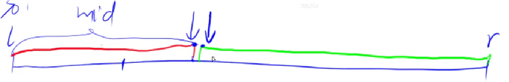
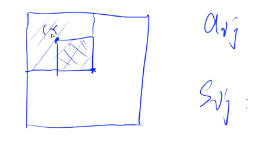
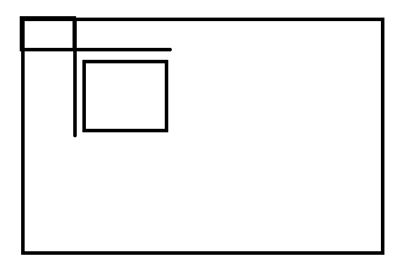
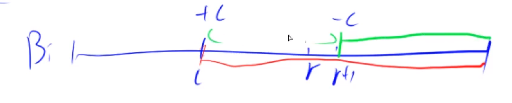
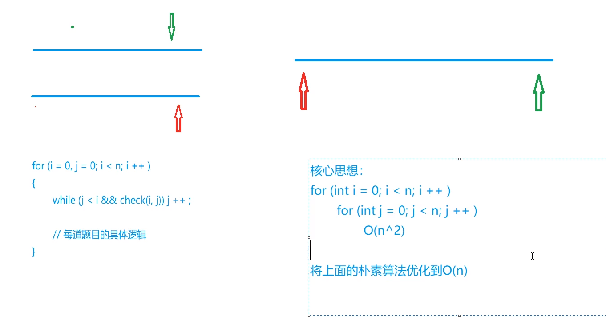
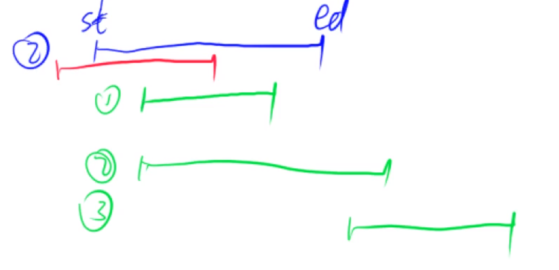

# ACWING

## 第一章 基础算法（一）

### 排序

#### 快速排序

分治思想：

1. 确定分界点：left or middle or right......
2. 调整左右，比如将比分界点小的放左边，比分界点大的放右边
3. 递归处理左右两段


```c++
void quick_sort(int q[],int l, int r){
    if(l >= r) return;

    //1. 确定分界点x
    //注意这里的i和j都比元素范围要大1 , 因为在后面的步骤中会先左移右移（swap之后肯定会先移动），所以将第一次也统一
    int i = l - 1, j = r + 1, x = q[(l + r) >> 1];

    //2. 调整左右，比如将比分界点小的放左边，比分界点大的放右边
    while(i < j){
        while (q[++i] < x);
        while (q[--j] > x);
        //注意还需判断一次 i < j
        if(i < j)
            swap(q[i],q[j]);
    }

    //3. 递归处理左右两段
    //注意判断条件时不能用i，因为此时如果退出则状态一定是 i >= j，所以取最小的j
    quick_sort(q,l,j);
    quick_sort(q,j+1 , r);
}
```


#### 归并排序

1. 递归排序左边和右边
2. 归并，将两个有序的数组合并为一个有序的数组
3. 将tmp数组重新赋值回q数组


```c++
void merge_sort(int q[],int l, int r){
    if(l >= r) return;

    //1. 递归排序左边和右边
    int mid = (l + r) >>1;
    merge_sort(q,l,mid);
    merge_sort(q,mid + 1,r);

    //2. 归并，将两个有序的数组合并为一个有序的数组
    int *tmp = new int[r-l+1];
    int k = 0, i = l, j = mid + 1;
    while (i <= mid && j <= r){
        if(q[i] < q[j])
            tmp[k++] = q[i++];
        else
            tmp[k++] = q[j++];
    }

    while (i <= mid) tmp[k++] = q[i++];
    while (j <= r) tmp[k++] = q[j++];

    //3. 赋值回原来的q
    for(i = l,j = 0; i <= r ;i++,j++){
        q[i] = tmp[j];
    }
}
```


### 二分法

#### 整数二分

有单调性的能二分，能二分的不一定需要有单调性

本质：边界

假设在绿色部分的是正确的，红色部分是不包含的



二分法获得红色点：

1. 找mid = (l+r+**1**)>>1，判断中间值是不是满足性质（这里假设是判断mid在不在红色那边）
2. if(check(mid))
   - true 即mid处于红色部分：红色的边界点一定在[mid,r] l=mid
   - false 即mid处于绿色部分：红色的边界点一定在 [l,mid-1] r = mid-1，


二分法获得绿色点：

1. 找mid = (l+r)>>1，判断中间值是不是满足性质（这里假设是判断mid在不在绿色那边）
2. if(check(mid))
   - true 即mid处于绿色部分：绿色的边界点一定在[l,mid] r=mid
   - false 即mid处于红色部分：绿色的边界点一定在 [mid+1,r] l=mid+1


注意找红点时因为有r=mid-1，需要在计算mid时用l+r+1，需要避免死循环，因为r在-1后可以需要+1弥补下取整

```c++
bool check(int x) {/* ... */} // 检查x是否满足某种性质

// 区间[l, r]被划分成[l, mid]和[mid + 1, r]时使用：
//找绿
//找左界限的，第一个....
int bsearch_1(int l, int r)
{
    while (l < r)
    {
        int mid = l + r >> 1;
        if (check(mid)) r = mid;    // check()判断mid是否满足性质
        else l = mid + 1;
    }
    return l;
}
// 区间[l, r]被划分成[l, mid - 1]和[mid, r]时使用：
//找红
//找右界限的，最后一个....
int bsearch_2(int l, int r)
{
    while (l < r)
    {
        int mid = l + r + 1 >> 1;
        if (check(mid)) l = mid;
        else r = mid - 1;
    }
    return l;
}
```


#### 浮点二分

```c++
bool check(double x) {/* ... */} // 检查x是否满足某种性质

double bsearch_3(double l, double r)
{
    const double eps = 1e-6;   // eps 表示精度，取决于题目对精度的要求
    while (r - l > eps)
    {
        double mid = (l + r) / 2;
        if (check(mid)) r = mid;
        else l = mid;
    }
    return l;
}
```


## 第一章 基础算法（二）

### 高精度

用数组存大整数，个位等低位在小索引

#### 高精度加法

2种情况：

- Ai + Bi
- Ai + Bi + C~i-1~(t)

```cpp
std::vector<int> add(std::vector<int> A, std::vector<int> B){
    if(B.size() > A.size())
        return add(B,A);
    int t = 0;
    std::vector<int> C;
    for(int i = 0; i < A.size(); i++){
        //上一次循环包含了进位
        t += A[i];
        if(i < B.size())
            t += B[i];

        C.push_back(t % 10);
        t /= 10;
    }
    if(t)
        C.push_back(t);
    return C;
}
```


#### 高精度减法

首先：

- A - B = A -B(A >= B)
- A - B = -(B - A)

需要先判断A,B大小


2种情况：

- Ai - Bi (Ai >= Bi)
- Ai - Bi + 10 - t

```cpp
//判断是否有 A >=B
bool cmp(std::vector<int> A, std::vector<int> B){
    if(A.size() != B.size())
        return A.size() > B.size();
    for(int i = A.size() - 1; i >= 0; i--){
        if(A[i] != B[i])
            return A[i] > B[i];
    }
    return true;
}

//输入进来一定是大数-小数 , A.size() >= B.size()
std::vector<int> sub(std::vector<int> A, std::vector<int> B){
    int t = 0;
    std::vector<int> C;
    for(int i = 0; i < A.size(); i++){
        t = A[i] - t;
        if(i < B.size())
            t -= B[i];
        //+10为避免t此刻是负数
        C.push_back((t + 10) % 10);

        if(t < 0) t = 1;
        else t = 0;
    }

    //删除所有前导0，比如003
    while (C.size() > 1 && C.back() == 0)
        C.pop_back();
    return C;
}
```


#### 高精度乘法

目前只处理了大数*小数

(Ai * Bi + t~i-1~) % 10

ti = (Ai * Bi + t~i-1~) / 10

```cpp
#include <iostream>
#include <vector>

//默认A是大数，B是小数
std::vector<int> mul(std::vector<int> A, int B){
    int t = 0;
    std::vector<int> C;
    for(int i = 0; i < A.size(); i++){
        //上一次循环包含了进位
        t += A[i] * B;

        C.push_back(t % 10);
        t /= 10;
    }
    if(t)
        C.push_back(t);

    //如果t是0的话，还是得删个前导0
    while (C.size() > 1 && C.back() == 0) C.pop_back();
    return C;
}
```


#### 高精度除法

目前只处理大数 / 小数

**左一位除完的余数 * 10 + Ai **是本次用来除的数

```cpp
#include <iostream>
#include <vector>
#include <tuple>
#include <algorithm>

//默认A是大数，B是小数
std::tuple<std::vector<int>,int> div(std::vector<int> A, int B){
    int t = 0;
    std::vector<int> C;
    for(int i = 0; i < A.size(); i++){
        //t是余数
        //t先是这次拿来除的数 , 左一位除完的余数 * 10 + Ai 是本次用来除的数
        t = A[i] + t * 10;
        C.push_back( t / B);
        t %= B;
    }

    //倒转一下C，方便删除前导0
    std::reverse(C.begin(),C.end());
    //删除前导0
    while (C.size() > 1 && C.back() == 0) C.pop_back();
    return {C,t};
}
```


### 前缀和

#### 一维前缀和

a1 , a2 , a3 , a4 ... an **注意下标是从1开始**

前缀和Si = a1 + a2 + ... + ai

作用：

求[a~l~,a~r~]的和 = S~r~ - S~l-1~


定义S0 = 0，前缀和比如S10也可以表示为S10 - S0

```cpp
S[i] = a[1] + a[2] + ... a[i]
a[l] + ... + a[r] = S[r] - S[l - 1]
```


```cpp
#include <iostream>

int main(){
    int n,m;
    scanf("%d %d",&n,&m);

    //计算前缀和
    //s0 = 0, 都往后挪一个
    int sum_prefix[n + 1];
    sum_prefix[0] = 0;
    int x;
    for(int i = 1; i <= n; i++){
        std::cin >> x;
        sum_prefix[i] = sum_prefix[i - 1] + x;
    }

    int l ,r;
    for(int i = 0; i < m; i++){
        //读入l, r
        scanf("%d %d",&l,&r);
        printf("%d\n",sum_prefix[r] - sum_prefix[l - 1]);
    }
}
```


#### 二维前缀和



Sij代表小正方形内数的和

**如想求图中蓝正方形内数的和：S~x2y2~ - S~x2,y1-1~ - S~x1-1,y2~ + S~x1-1,y1-1~**




**前缀和：Sij = S~i-1,j~ + S~i,j-1~ - S~i-1,j-1~ + aij**

```cpp
#include <iostream>

int main(){
    int n,m,q;
    int x;
    std::cin >> n >> m >> q;
    int sum_prefix[n + 1][m + 1];
    for(int i = 0; i <= m; i++)
        sum_prefix[0][i] = 0;
    for(int i = 0; i <= n; i++)
        sum_prefix[i][0] = 0;

    for(int i = 1; i <= n; i++)
        for(int j = 1; j <= m; j++){
            std::cin >> x;
            sum_prefix[i][j] = sum_prefix[i - 1][j] + sum_prefix[i][j - 1] - sum_prefix[i - 1][j - 1] + x;
        }

    for(int i = 0; i < q; i++){
        int x1,y1,x2,y2;
        std::cin >> x1 >> y1 >> x2 >> y2;
        std::cout << sum_prefix[x2][y2] - sum_prefix[x1 - 1][y2] - sum_prefix[x2][y1 - 1] + sum_prefix[x1 - 1][y1 - 1] << std::endl;
    }
}
```


### 差分

#### 一维数组

有数组a1,a2,...an

要构造b数组使得ai = b1 + b2 +...+bi，即使得a数组是b数组的前缀和，那么b数组就称为a数组的差分

比如一维：

b1 = a1

b2 = a2 - a1

b3 = a3 - a2

...

bn = an - a~n-1~


作用示例：需要将a数组[l,r]索引的每个元素都加上constant c

可以在b差分上用O(1)操作完成：

由于a数组是通过求b数组的前缀和得到，在l处+c意味着a数组从l开始的所有元素都加上了c（算前缀和时都要算B[l]），在r+1处-c意味着a数组从r+1开始的所有元素都减去了c




**假设a数组初始时全都为0，那么b差分数组初始时也全都为0，可以将实际的a数组看成n次插入操作，每次差分数组b将插入a1元素这个操作看成在原数组（初始为全0）基础上的[1,1]区间加上a1**

即构造bn到完成要求整个过程只有一个操作：``给区间[l, r]中的每个数加上c：B[l] += c, B[r + 1] -= c``

```cpp
#include <iostream>

using namespace std;

void insert(int l ,int r, int c, int b[]){
    b[l] += c;
    b[r + 1] -= c;
}

int main(){
    int n,m;
    cin >> n >> m;
    //insert算法涉及到r + 1，所以数组b多开一列
    int a[n + 1],b[n + 2];
    a[0] = 0;
    for(int i = 1; i <= n; i++)
        cin >> a[i];
    for(int i = 0; i <= n + 1; i++)
        b[i] = 0;

    for(int i = 1; i <= n; i++)
        //假设a数组初始时全都为0，那么b差分数组初始时也全都为0，可以将实际的a数组看成n次插入操作，差分数组b将插入a1元素看成在原数组（初始为全0）基础上的[1,1]区间加上a1
        //所以全过程包括bn的初始化都是insert操作
        insert(i,i,a[i],b);

    while (m--){
        int l,r,c;
        cin >> l >> r >> c;
        insert(l,r,c,b);
    }

    //求最终数组,即已知bn差分数组，求an前缀和数组
    for(int i = 1; i <= n;i++){
        a[i] = b[i] + a[i - 1];
        printf("%d ",a[i]);
    }
    return 0;
}
```


#### 二维数组

```
给以(x1, y1)为左上角，(x2, y2)为右下角的子矩阵中的所有元素加上c：
S[x1, y1] += c, S[x2 + 1, y1] -= c, S[x1, y2 + 1] -= c, S[x2 + 1, y2 + 1] += c
```

初始化操作的每一次插入 相当于对(i,j)到(i,j)范围加上一个数

```cpp
#include <iostream>

using namespace std;

void insert(int x1, int y1, int x2, int y2, int c, int **b){
    b[x1][y1] += c;
    b[x2 + 1][y1] -= c;
    b[x1][y2 + 1] -= c;
    b[x2 + 1][y2 + 1] += c;
}

int main(){
    int n,m,q;
    cin >> n >> m >> q;
    int a[n + 1][m + 1];
    //注意这里和下面清0的时候要给b分内存
    //由于insert涉及到边界+1，这里需要多+2多分内存
    int** b = new int*[n + 2];
    //清0操作
    //1. b数组
    for(int i = 0; i <= n + 1; i++){
        b[i] = new int[m + 2];
        for(int j = 0; j <= m + 1;j++)
            b[i][j] = 0;
    }
    //2. a数组
    for(int i = 0; i <= n; i++)
        a[i][0] = 0;
    for(int i = 0; i <= m; i++)
        a[0][i] = 0;

    for(int i = 1; i <= n; i++)
        for(int j = 1; j <= m; j++)
            cin >> a[i][j];

    //初始化b差分数组
    for(int i = 1; i <= n; i++)
        for(int j = 1; j <= m; j++)
            insert(i, j, i, j, a[i][j], b);

    while (q--){
        int x1,y1,x2,y2,c;
        cin >> x1 >> y1 >> x2 >> y2 >> c;
        insert(x1,y1,x2,y2,c,b);
    }

    //求最终数组,即已知bn差分数组，求an前缀和数组
    for(int i = 1; i <= n;i++){
        for(int j = 1; j <= m; j++){
            a[i][j] = b[i][j] + a[i - 1][j] + a[i][j - 1] - a[i - 1][j - 1];
            cout << a[i][j] << " ";
        }
        cout << endl;
    }

    //释放b占用内存
    for (int i = 0; i <= n + 1; i++) {
        delete[] b[i];
    }
    delete[] b;
    return 0;
}
```


## 第一章 基础算法（三）

### 双指针算法



### 位运算

1. 求一个整数n的二进制表示的第k位数是几

   - 先把第k位数字移到最后一位 n >> k
   - 看看个位是几 x& 1

   即(n >> j) & 1

2. lowbit(x): 返回x的最后一个1是多少 , x & -x = x& (~x + 1)可得（可以自己试试，补码,-x与~x+1都是补码），比如10101100返回100

   

   求一个数有多少个1，可以用lowbit思想，减了多少次，就有多少个1

   示例：

   ```cpp
   #include <iostream>
   using namespace std;
   
   //lowbit(x): 返回x的最后一个1是多少 , x & -x = x& (~x + 1)可得（可以自己试试，补码,-x与~x+1都是补码），比如10101100返回100
   int lowbit(int x){
       return x & -x;
   }
   
   int main(){
       int n;
       cin >> n;
       while (n--){
           int x;
           cin >> x;
           //求一个数有多少个1，可以用lowbit思想，减了多少次，就有多少个1
           int res = 0;
           while (x){
               x -= lowbit(x);
               res++;
           }
           cout << res << " ";
       }
   }
   ```

   

### 整数保序离散化

离散化要用vector


值域大，比如0-10^9，但是个数远不如那么多，但是可能需要开数组，但我们不能开到10 ^9那么大，于是需要选出一些数，映射，比如：


这就叫离散化。

问题：

1. a中可能有重复元素，所以需要去重，**去重就是离散化的过程，至于映射关系，没有使用map保存，每次用find现找现算**

   去重写法：

   ```cpp
   vector<int> alls;    //存储所有待离散化的值
   sort(alls.begin(),alls.end());     //将所有值排序
   alls.erase(unique(alls.begin(),alls.end()),alls.end());   //去掉重复元素
   ```

   unique会把重复元素都丢到后面，erase将重复元素开始的索引到end全给删掉就好

2. 如何算出a[i]离散化后的值是多少（二分）

   ```cpp
   // 二分求出x对应的离散化的值
   int find(int x) // 找到第一个大于等于x的位置
   {
       int l = 0, r = alls.size() - 1;
       while (l < r)
       {
           int mid = l + r >> 1;
           if (alls[mid] >= x) r = mid;
           else l = mid + 1;
       }
       //加不加一与题目有关
       return r + 1; // 映射到1, 2, ...n
   }
   ```

   由于这里去重唯一且一定有对应值，所以找红色（右界限，即最后一个小于等于x的位置）也是ok的

   ```cpp
   //找到最后一个小于等于x的位置
   int find(int x)
   {
       int l = 0, r = alls.size() - 1;
       while (l < r)
       {
           int mid = (l + r + 1) >> 1;
           if (alls[mid] <= x) l = mid;
           else r = mid - 1;
       }
       return r+1;
   }
   ```

   

### 区间合并

1. 按区间左端点排序

2. 扫描整个区间，把所有可能的区间合并

   

   由于按照左端点排序了，只可能出现三种绿色情况，而不会出现红色情况

   - 每次维护一个当前的区间

   ```cpp
   // 将所有存在交集的区间合并
   void merge(vector<PII> &segs)
   {
       vector<PII> res;
   
       sort(segs.begin(), segs.end());
   
       int st = -2e9, ed = -2e9;
       for (auto seg : segs)
           //左端大于right，则一定是新段
           //由于是左端升序，之后的interval的左端也一定大于之前段的right，固之前的段不用再考虑
           if (ed < seg.first)
           {
               if (st != -2e9) res.push_back({st, ed});
               st = seg.first, ed = seg.second;
           }
           else ed = max(ed, seg.second);
   
       //这是防止输入区间为空
       if (st != -2e9) res.push_back({st, ed});
   
       segs = res;
   }
   ```

   也可以是：

   ```cpp
   //以左端排序
       sort(intervals.begin(),intervals.end());
       int res = 1;
       int right = intervals[0].second;
       for(int i = 1; i < n; i++){
           if(intervals[i].first <= right)
               right = max( right, intervals[i].second);
           else{
               //左端大于right，则一定是新段
               //由于是左端升序，之后的interval的左端也一定大于之前段的right，固之前的段不用再考虑
               res++;
               right = intervals[i].second;
           }
       }
       //判断一下非空
       if(intervals.empty())
           res = 0;
       cout << res << endl;
   ```

   

# 小技巧

可以专门拿一个数组记录各个元素出现次数，便于判断处理是否重复
