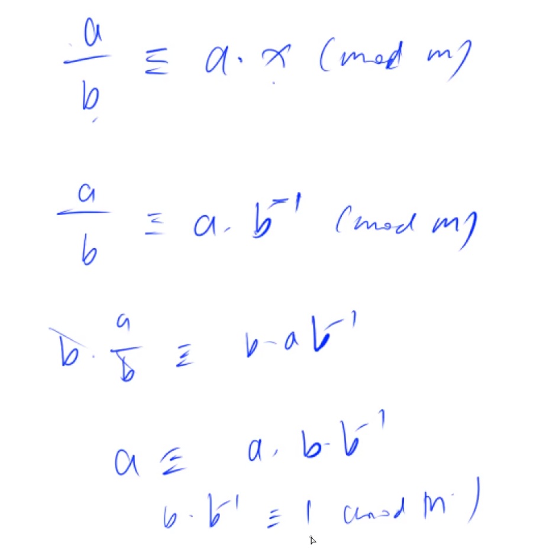
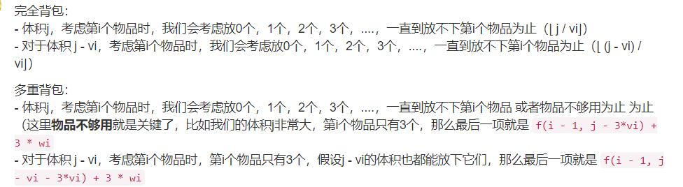

# ACWING

## 第一章 基础算法（一）

### 排序

#### 快速排序

分治思想：

1. 确定分界点：left or middle or right......
2. 调整左右，比如将比分界点小的放左边，比分界点大的放右边
3. 递归处理左右两段

时间复杂度nlogn，因为平均每次都取中间，树的高度是logn

```c++
void quick_sort(int q[],int l, int r){
    //lsy 节约时间的，别忘这个
    if(l >= r) return;

    //1. 确定分界点x
    //注意这里的i和j都比元素范围要大1 , 因为在后面的步骤中会先左移右移（swap之后肯定会先移动），所以将第一次也统一
    //lsy 注意这里必须把选的分界点的值算出来，不能每次用q[mid],q[mid]的值是可能变的
    int i = l - 1, j = r + 1, x = q[(l + r) >> 1];

    //2. 调整左右，比如将比分界点小的放左边，比分界点大的放右边
    while(i < j){
        //lsy 用++i,--j这样无论条件while第一次是否成立，都会走一步，不这样的话可能会死循环，比如while() i++这样可能会死循环
        //lsy 而用++i的好处就是swap的就是当前索引值，如果i++则在>=x的索引是i已经又向右走了一次了
        while (q[++i] < x);
        while (q[--j] > x);
        //注意还需判断一次 i < j
        if(i < j)
            swap(q[i],q[j]);
    }

    //3. 递归处理左右两段
    //注意判断条件时不能用i，因为此时如果退出则状态一定是 i >= j，所以取最小的j（因为我们用的是j和j+1，所以需要取小的） 
    //比如49 59 88 37 98 97 68 54 31 3
    //第一波完了之后49 59 88 37 3 97 68 54 31 98, j指向31, i指向98，显然j是对的
    //而比如49 59 88 37 3 97 68 54 31 98
    //第一波完了之后3 59 88 37 49 97 68 54 31 98, j指向3, i指向59，显然j+1作第二段是对的
    
    //不要用i
    //3 1 2 4 5第一波走完是2 1 3 4 5 , i,j都指向1，我们需要对2,1再排
    quick_sort(q,l,j);
    quick_sort(q,j+1 , r);
}
```


#### 归并排序

1. 递归排序左边和右边
2. 归并，将两个有序的数组合并为一个有序的数组
3. 将tmp数组重新赋值回q数组


```c++
void merge_sort(int q[],int l, int r){
    //lsy 别忘了这个
    if(l >= r) return;

    //1. 递归排序左边和右边
    int mid = (l + r) >>1;
    merge_sort(q,l,mid);
    merge_sort(q,mid + 1,r);

    //2. 归并，将两个有序的数组合并为一个有序的数组
    int *tmp = new int[r-l+1];
    int k = 0, i = l, j = mid + 1;
    while (i <= mid && j <= r){
        if(q[i] < q[j])
            tmp[k++] = q[i++];
        else
            tmp[k++] = q[j++];
    }

    while (i <= mid) tmp[k++] = q[i++];
    while (j <= r) tmp[k++] = q[j++];

    //3. 赋值回原来的q
    //lsy 注意这里的起点是不同的
    for(i = l,j = 0; i <= r ;i++,j++){
        q[i] = tmp[j];
    }
}
```


### 二分法

#### 整数二分

有单调性的能二分，能二分的不一定需要有单调性

本质：边界

假设在绿色部分的是正确的，红色部分是不包含的


二分法获得红色点：

1. 找mid = (l+r+**1**)>>1，判断中间值是不是满足性质（这里假设是判断mid在不在红色那边）
2. if(check(mid))
   - true 即mid处于红色部分：红色的边界点一定在[mid,r] l=mid
   - false 即mid处于绿色部分：红色的边界点一定在 [l,mid-1] r = mid-1，


二分法获得绿色点：

1. 找mid = (l+r)>>1，判断中间值是不是满足性质（这里假设是判断mid在不在绿色那边）
2. if(check(mid))
   - true 即mid处于绿色部分：绿色的边界点一定在[l,mid] r=mid
   - false 即mid处于红色部分：绿色的边界点一定在 [mid+1,r] l=mid+1


注意找红点时因为有r=mid-1，需要在计算mid时用l+r+1，需要避免死循环，因为r在-1后可以需要+1弥补下取整

==右边r要撑起来，red也是right右界限==

找左界限，返回l，重要变化肯定是l=mid+1；

找右界限，返回r，重要变化肯定是r=mid-1；

```c++
bool check(int x) {/* ... */} // 检查x是否满足某种性质

// 区间[l, r]被划分成[l, mid]和[mid + 1, r]时使用：
//找绿
//找左界限的，第一个....
int bsearch_1(int l, int r)
{
    while (l < r)
    {
        int mid = l + r >> 1;
        if (check(mid)) r = mid;    // check()判断mid是否满足性质
        else l = mid + 1;
    }
    return l;
}
// 区间[l, r]被划分成[l, mid - 1]和[mid, r]时使用：
//找红
//找右界限的，最后一个....
int bsearch_2(int l, int r)
{
    while (l < r)
    {
        int mid = l + r + 1 >> 1;
        if (check(mid)) l = mid;
        else r = mid - 1;
    }
    return l;
}
```


#### 浮点二分

```c++
bool check(double x) {/* ... */} // 检查x是否满足某种性质

double bsearch_3(double l, double r)
{
    const double eps = 1e-7;   // eps 表示精度，取决于题目对精度的要求
    //! lsy 注意eps是用在while里
    while (r - l > eps)
    {
        double mid = (l + r) / 2;
        if (check(mid)) r = mid;
        else l = mid;
    }
    return l;
}
```


## 第一章 基础算法（二）

### 高精度

用数组存大整数，个位等低位在小索引

#### 高精度加法

2种情况：

- Ai + Bi
- Ai + Bi + C~i-1~(t)

```cpp
std::vector<int> add(std::vector<int> A, std::vector<int> B){
    if(B.size() > A.size())
        return add(B,A);
    int t = 0;
    std::vector<int> C;
    for(int i = 0; i < A.size(); i++){
        //上一次循环包含了进位
        t += A[i];
        if(i < B.size())
            t += B[i];

        C.push_back(t % 10);
        t /= 10;
    }
    if(t)
        C.push_back(t);
    return C;
}
```


#### 高精度减法

首先：

- A - B = A -B(A >= B)
- A - B = -(B - A)

需要先判断A,B大小


2种情况：

- Ai - Bi (Ai >= Bi)
- Ai - Bi + 10 - t

```cpp
//判断是否有 A >=B
bool cmp(std::vector<int> A, std::vector<int> B){
    if(A.size() != B.size())
        return A.size() > B.size();
    for(int i = A.size() - 1; i >= 0; i--){
        if(A[i] != B[i])
            return A[i] > B[i];
    }
    return true;
}

//输入进来一定是大数-小数 , A.size() >= B.size()
std::vector<int> sub(std::vector<int> A, std::vector<int> B){
    int t = 0;
    std::vector<int> C;
    for(int i = 0; i < A.size(); i++){
        t = A[i] - t;
        if(i < B.size())
            t -= B[i];
        //+10为避免t此刻是负数
        C.push_back((t + 10) % 10);

        if(t < 0) t = 1;
        else t = 0;
    }

    //删除所有前导0，比如003
    while (C.size() > 1 && C.back() == 0)
        C.pop_back();
    return C;
}
```


#### 高精度乘法

目前只处理了大数*小数

(Ai * Bi + t~i-1~) % 10

ti = (Ai * Bi + t~i-1~) / 10

```cpp
#include <iostream>
#include <vector>

//默认A是大数，B是小数
std::vector<int> mul(std::vector<int> A, int B){
    int t = 0;
    std::vector<int> C;
    for(int i = 0; i < A.size(); i++){
        //上一次循环包含了进位
        t += A[i] * B;

        C.push_back(t % 10);
        t /= 10;
    }
    if(t)
        C.push_back(t);

    //如果t是0的话，还是得删个前导0
    while (C.size() > 1 && C.back() == 0) C.pop_back();
    return C;
}
```


#### 高精度除法

目前只处理大数 / 小数

**左一位除完的余数 * 10 + Ai **是本次用来除的数

```cpp
#include <iostream>
#include <vector>
#include <tuple>
#include <algorithm>

//默认A是大数，B是小数
std::tuple<std::vector<int>,int> div(std::vector<int> A, int B){
    int t = 0;
    std::vector<int> C;
    for(int i = 0; i < A.size(); i++){
        //t是余数
        //t先是这次拿来除的数 , 左一位除完的余数 * 10 + Ai 是本次用来除的数
        t = A[i] + t * 10;
        C.push_back( t / B);
        t %= B;
    }

    //lsy 记得这个reverse
    //倒转一下C，方便删除前导0
    std::reverse(C.begin(),C.end());
    //删除前导0
    while (C.size() > 1 && C.back() == 0) C.pop_back();
    return {C,t};
}
```


### 前缀和

#### 一维前缀和

a1 , a2 , a3 , a4 ... an **注意下标是从1开始**

前缀和Si = a1 + a2 + ... + ai

作用：

求[a~l~,a~r~]的和 = S~r~ - S~l-1~


定义S0 = 0，前缀和比如S10也可以表示为S10 - S0

```cpp
S[i] = a[1] + a[2] + ... a[i]
a[l] + ... + a[r] = S[r] - S[l - 1]
```


```cpp
#include <iostream>

int main(){
    int n,m;
    scanf("%d %d",&n,&m);

    //计算前缀和
    //s0 = 0, 都往后挪一个
    int sum_prefix[n + 1];
    sum_prefix[0] = 0;
    int x;
    for(int i = 1; i <= n; i++){
        std::cin >> x;
        sum_prefix[i] = sum_prefix[i - 1] + x;
    }

    int l ,r;
    for(int i = 0; i < m; i++){
        //读入l, r
        scanf("%d %d",&l,&r);
        printf("%d\n",sum_prefix[r] - sum_prefix[l - 1]);
    }
}
```


#### 二维前缀和


Sij代表小正方形内数的和

**如想求图中蓝正方形内数的和：S~x2y2~ - S~x2,y1-1~ - S~x1-1,y2~ + S~x1-1,y1-1~**


**前缀和：Sij = S~i-1,j~ + S~i,j-1~ - S~i-1,j-1~ + aij**

```cpp
#include <iostream>

int main(){
    int n,m,q;
    int x;
    std::cin >> n >> m >> q;
    int sum_prefix[n + 1][m + 1];
    for(int i = 0; i <= m; i++)
        sum_prefix[0][i] = 0;
    for(int i = 0; i <= n; i++)
        sum_prefix[i][0] = 0;

    for(int i = 1; i <= n; i++)
        for(int j = 1; j <= m; j++){
            std::cin >> x;
            sum_prefix[i][j] = sum_prefix[i - 1][j] + sum_prefix[i][j - 1] - sum_prefix[i - 1][j - 1] + x;
        }

    for(int i = 0; i < q; i++){
        int x1,y1,x2,y2;
        std::cin >> x1 >> y1 >> x2 >> y2;
        std::cout << sum_prefix[x2][y2] - sum_prefix[x1 - 1][y2] - sum_prefix[x2][y1 - 1] + sum_prefix[x1 - 1][y1 - 1] << std::endl;
    }
}
```


### 差分

#### 一维数组

有数组a1,a2,...an

要构造b数组使得ai = b1 + b2 +...+bi，即使得a数组（原数组）是b数组（差分数组）的前缀和，那么b数组就称为a数组的差分

比如一维：

b1 = a1

b2 = a2 - a1

b3 = a3 - a2

...

bn = an - a~n-1~


作用示例：需要将a数组[l,r]索引的每个元素都加上constant c

可以在b差分上用O(1)操作完成：

由于a数组是通过求b数组的前缀和得到，在l处+c意味着a数组从l开始的所有元素都加上了c（算前缀和时都要算B[l]），在r+1处-c意味着a数组从r+1开始的所有元素都减去了c


**假设a数组初始时全都为0，那么b差分数组初始时也全都为0，可以将实际的a数组看成n次插入操作，每次差分数组b将插入a1元素这个操作看成在原数组（初始为全0）基础上的[1,1]区间加上a1**

即构造bn到完成要求整个过程只有一个操作：``给区间[l, r]中的每个数加上c：B[l] += c, B[r + 1] -= c``

```cpp
#include <iostream>

using namespace std;

void insert(int l ,int r, int c, int b[]){
    b[l] += c;
    b[r + 1] -= c;
}

int main(){
    int n,m;
    cin >> n >> m;
    //insert算法涉及到r + 1，所以数组b多开一列
    int a[n + 1],b[n + 2];
    a[0] = 0;
    for(int i = 1; i <= n; i++)
        cin >> a[i];
    for(int i = 0; i <= n + 1; i++)
        b[i] = 0;

    for(int i = 1; i <= n; i++)
        //假设a数组初始时全都为0，那么b差分数组初始时也全都为0，可以将实际的a数组看成n次插入操作，差分数组b将插入a1元素看成在原数组（初始为全0）基础上的[1,1]区间加上a1
        //所以全过程包括bn的初始化都是insert操作
        insert(i,i,a[i],b);

    while (m--){
        int l,r,c;
        cin >> l >> r >> c;
        insert(l,r,c,b);
    }

    //求最终数组,即已知bn差分数组，求an前缀和数组
    for(int i = 1; i <= n;i++){
        a[i] = b[i] + a[i - 1];
        printf("%d ",a[i]);
    }
    return 0;
}
```


#### 二维数组

```
给以(x1, y1)为左上角，(x2, y2)为右下角的子矩阵中的所有元素加上c：
S[x1, y1] += c, S[x2 + 1, y1] -= c, S[x1, y2 + 1] -= c, S[x2 + 1, y2 + 1] += c
```

初始化操作的每一次插入 相当于对(i,j)到(i,j)范围加上一个数

```cpp
#include <iostream>

using namespace std;

void insert(int x1, int y1, int x2, int y2, int c, int **b){
    b[x1][y1] += c;
    b[x2 + 1][y1] -= c;
    b[x1][y2 + 1] -= c;
    b[x2 + 1][y2 + 1] += c;
}

int main(){
    int n,m,q;
    cin >> n >> m >> q;
    int a[n + 1][m + 1];
    //注意这里和下面清0的时候要给b分内存
    //由于insert涉及到边界+1，这里需要多+2多分内存
    int** b = new int*[n + 2];
    //清0操作
    //1. b数组
    for(int i = 0; i <= n + 1; i++){
        b[i] = new int[m + 2];
        for(int j = 0; j <= m + 1;j++)
            b[i][j] = 0;
    }
    //2. a数组
    for(int i = 0; i <= n; i++)
        a[i][0] = 0;
    for(int i = 0; i <= m; i++)
        a[0][i] = 0;

    for(int i = 1; i <= n; i++)
        for(int j = 1; j <= m; j++)
            cin >> a[i][j];

    //初始化b差分数组
    for(int i = 1; i <= n; i++)
        for(int j = 1; j <= m; j++)
            insert(i, j, i, j, a[i][j], b);

    while (q--){
        int x1,y1,x2,y2,c;
        cin >> x1 >> y1 >> x2 >> y2 >> c;
        insert(x1,y1,x2,y2,c,b);
    }

    //求最终数组,即已知bn差分数组，求an前缀和数组
    for(int i = 1; i <= n;i++){
        for(int j = 1; j <= m; j++){
            a[i][j] = b[i][j] + a[i - 1][j] + a[i][j - 1] - a[i - 1][j - 1];
            cout << a[i][j] << " ";
        }
        cout << endl;
    }

    //释放b占用内存
    for (int i = 0; i <= n + 1; i++) {
        delete[] b[i];
    }
    delete[] b;
    return 0;
}
```


## 第一章 基础算法（三）

### 双指针算法


### 位运算

1. 求一个整数n的二进制表示的第k位数是几

   - 先把第k位数字移到最后一位 n >> k
   - 看看个位是几 x& 1

   即(n >> j) & 1

2. lowbit(x): 返回x的最后一个1是多少 , x & -x = x& (~x + 1)可得（可以自己试试，补码,-x与~x+1都是补码），比如10101100返回100

   

   求一个数有多少个1，可以用lowbit思想，减了多少次，就有多少个1

   示例：

   ```cpp
   #include <iostream>
   using namespace std;
   
   //lowbit(x): 返回x的最后一个1是多少 , x & -x = x& (~x + 1)可得（可以自己试试，补码,-x与~x+1都是补码），比如10101100返回100
   int lowbit(int x){
       return x & -x;
   }
   
   int main(){
       int n;
       cin >> n;
       while (n--){
           int x;
           cin >> x;
           //求一个数有多少个1，可以用lowbit思想，减了多少次，就有多少个1
           int res = 0;
           while (x){
               x -= lowbit(x);
               res++;
           }
           cout << res << " ";
       }
   }
   ```

   

### 整数保序离散化

离散化要用vector


值域大，比如0-10^9，但是个数远不如那么多，但是可能需要开数组，但我们不能开到10 ^9那么大，于是需要选出一些数，映射，比如：


这就叫离散化。

问题：

1. a中可能有重复元素，所以需要去重，**去重就是离散化的过程，至于映射关系，没有使用map保存，每次用find现找现算**

   去重写法：

   ```cpp
   //lsy 记住这个
   vector<int> alls;    //存储所有待离散化的值
   sort(alls.begin(),alls.end());     //将所有值排序
   alls.erase(unique(alls.begin(),alls.end()),alls.end());   //去掉重复元素
   ```

   unique会把重复元素都丢到后面，erase将重复元素开始的索引到end全给删掉就好

2. 如何算出a[i]离散化后的值是多少（二分）

   ```cpp
   // 二分求出x对应的离散化的值
   int find(int x) // 找到第一个大于等于x的位置
   {
       int l = 0, r = alls.size() - 1;
       while (l < r)
       {
           int mid = l + r >> 1;
           if (alls[mid] >= x) r = mid;
           else l = mid + 1;
       }
       //加不加一与题目有关
       //lsy 算前缀和记得加1，使得起始i是1
       return r + 1; // 映射到1, 2, ...n
   }
   ```
   
   由于这里去重唯一且一定有对应值，所以找红色（右界限，即最后一个小于等于x的位置）也是ok的
   
   ```cpp
   //找到最后一个小于等于x的位置
   int find(int x)
   {
       int l = 0, r = alls.size() - 1;
       while (l < r)
       {
           int mid = (l + r + 1) >> 1;
           if (alls[mid] <= x) l = mid;
           else r = mid - 1;
       }
       return r+1;
   }
   ```
   
   

### 区间合并

1. 按区间左端点排序

2. 扫描整个区间，把所有可能的区间合并

   

   由于按照左端点排序了，只可能出现三种绿色情况，而不会出现红色情况

   - 每次维护一个当前的区间

   ```cpp
   // 将所有存在交集的区间合并
   void merge(vector<PII> &segs)
   {
       vector<PII> res;
   
       sort(segs.begin(), segs.end());
   
       int st = -2e9, ed = -2e9;
       for (auto seg : segs)
           //左端大于right，则一定是新段
           //由于是左端升序，之后的interval的左端也一定大于之前段的right，固之前的段不用再考虑
           if (ed < seg.first)
           {
               if (st != -2e9) res.push_back({st, ed});
               st = seg.first, ed = seg.second;
           }
           else ed = max(ed, seg.second);
   
       //这是防止输入区间为空
       if (st != -2e9) res.push_back({st, ed});
   
       segs = res;
   }
   ```

   也可以是：

   ```cpp
   	//以左端排序
   	//lsy pair<int,int>的元素在sort的时候也会自然以左端排序
       sort(intervals.begin(),intervals.end());
       int res = 1;
       int right = intervals[0].second;
       for(int i = 1; i < n; i++){
           if(intervals[i].first <= right)
               right = max( right, intervals[i].second);
           else{
               //左端大于right，则一定是新段
               //由于是左端升序，之后的interval的左端也一定大于之前段的right，固之前的段不用再考虑
               res++;
               right = intervals[i].second;
           }
       }
       //判断一下非空
       if(intervals.empty())
           res = 0;
       cout << res << endl;
   ```
   
   

## 第二章 数据结构（一）

### 链表

用数组模拟链表、栈、队列等数据结构。**用结构体的化效率会慢，做笔试题里不会采用动态new Node()的方式**

单链表：邻接表：存储图和树

#### 单链表

- value用e表示，e[N]
- ne[N]表示某个点的next指针的下标索引是多少
- idx相当于指针，指当前已经用到了哪个点


```cpp
//head表示虚拟头结点的next指针 ， 是头节点的下标
//e[N]表示value
//ne[N]表示next指针对应的索引是多少
//idx相当于指针，指当前已经用到了哪个点
int head,e[N],ne[N],idx;

void init(){
    head = -1;
    idx = 0;
}

//头插法 , 是直接插入变成第一个结点，而不是变成第一个结点后面
void insert(int a){
    e[idx] = a;
    ne[idx] = head;  //它的下一个就是原来的第一个
    head = idx++;
}

//删除头结点
void remove(){
    head = ne[head];
}
```


#### 双链表

- l[N]：存左边点的index
- r[N]：存右边点的index
- 直接让下标为0的点为head，下标为1的点是tail
- 还是有e[N]和idx

没有专门的head了

```
//意思是 0始终是左端点，1始终是右端点，所有操作都在0和1中间进行
//index : 0 最左边结点........最右边结点 1
```

```cpp
const int N  = 100010;

// e[]表示节点的值，l[]表示节点的左指针，r[]表示节点的右指针，idx表示当前用到了哪个节点
int e[N], l[N], r[N], idx;

// 初始化
void init()
{
    //0是左端点，1是右端点
    r[0] = 1, l[1] = 0;
    idx = 2;
}

// 在节点a的右边插入一个数x
void insert(int a, int x)
{
    e[idx] = x;
    l[idx] = a, r[idx] = r[a];
    l[r[a]] = idx, r[a] = idx ++ ;
}

// 删除节点a
void remove(int a)
{
    l[r[a]] = l[a];
    r[l[a]] = r[a];
}
```


### 栈

数据结构：

就按照习惯的top从-1开始就好

```cpp
// tt表示栈顶
int stk[N], tt = 0;

// 向栈顶插入一个数
stk[ ++ tt] = x;

// 从栈顶弹出一个数
tt -- ;

// 栈顶的值
stk[tt];

// 判断栈是否为空，如果 tt > 0，则表示不为空
if (tt > 0)
{

}
```

#### 单调栈

给定一个序列，求一下在这个序列当中 每一个数左边（右边）**离它最近**比它大（小）的数

```cpp
常见模型：找出每个数左边离它最近的比它大/小的数
int tt = 0;
for (int i = 1; i <= n; i ++ )
{
    while (tt && check(stk[tt], i)) tt -- ;
    stk[ ++ tt] = i;
}
```

```
//每个元素进栈的时候如果栈里什么都没有说明左边没有比它小的
    //每进一个新元素，会把比它大的元素都掏出栈，但是如果它最大的话就它直接入栈。这样栈中留下的就只有比当前数小的数了，大的都被踢走了，加快了速度（比如下例2把3，4踢走）
    //理解为0 1 x，不知道x是不是比1大，不能把1踢出来；但是如果是1 0 x，无论如何第一个比x小的也不可能是1，所以0入栈时就可以把1踢掉了
    //如果把比它大的元素都掏出栈之后，栈空了，说明左边没有比它小的了

    //比如 3 4 2 7
    //3进栈时为空，所有直接输出-1 , 3进栈
    //4进栈时3比它小，所以输出3，4入栈
    //2进栈时栈顶元素4，3大于它，他们都出栈，出栈后栈空了，所以是-1
```


### 队列

数据结构：

注意hh设置为0，默认第一次取head是有东西的，保证hh比tt大是为了在判断empty的时候可以用tt >= hh作为not empty的条件

```cpp
int q[N];
//注意hh设置为0，默认第一次取head是有东西的，保证hh比tt大是为了在判断empty的时候可以用tt >= hh作为not empty的条件
int hh = 0,tt = -1;

void push(int x){
    q[++tt] = x;
}

void pop(){
    hh++;
}
```


#### 单调队列：滑动窗口

找最小的话，如果新插入的数比原先队尾元素还小，之前的队尾元素就可以删掉了（如果大则之前队尾的不能删，也不能删这个大的，因为队尾可以被滑掉）

找一个滑动窗口的最小值：

队列q存的是下标

- 第一步：判断hh是不是已经被窗口滑过了，划过了的话需要hh++
- 第二步：**idx又靠后值又小的数出现，说明之前的小数之后再也不会用了，永久性删除**
- 第三步：用对应下标存值

```cpp
for(int i = 0; i < n; i ++)
    {
        //维持滑动窗口的大小
        //当队列不为空(hh <= tt) 且 当当前滑动窗口的大小(i - q[hh] + 1)>我们设定的
        //滑动窗口的大小(k),队列弹出队列头元素以维持滑动窗口的大小
        if(hh <= tt && k < i - q[hh] + 1)
            hh ++;
        //构造单调递增队列
        //当队列不为空(hh <= tt) 且 当队列队尾元素>=当前元素(a[i])时,那么队尾元素
        //就一定不是当前窗口最小值,删去队尾元素,加入当前元素(q[ ++ tt] = i)
        while(hh <= tt && a[q[tt]] >= a[i])
            tt --;
        q[ ++ tt] = i;
        if(i + 1 >= k) printf("%d ", a[q[hh]]);
    }
```

举个例子：

```
8 3
1 3 -1 -3 5 3 6 7
```

- 1入队列，q[0] = 0; tt=1

- 3入队列，q[1] = 1; tt =2

- -1来了，-1比1，3都小，**idx又靠后值又小，说明1，3今后再也不会被用到了，永久性删除1，3**；

  于是q[0]= 2，tt=1。第一次输出a[q[0]] = a[2] = -1    **//2**

- -3来了，-3比-1小，同理删除-1，于是q[0] = 3,tt=1，输出a[q[0]] = a[3] = -3

- 5来了，q[1]=4, tt=2，输出a[q[0]] = a[3] = -3

- 3来了，3比5小，于是q[1]=5,tt=2，q[0]仍等于3，输出a[q[0]] = a[3] = -3

- 6来了，由于k = 3 < 6 - q[hh]=3 + 1，所以原先的hh经过滑动窗口之后就没有了，hh得右移。这里只if没有while的原因是，滑动窗口每次只划一个，一次只可能淘汰 一个,hh只用+1。于是q[2]=6 , tt=3，输出a[q[1]] = a[5] = 3

- ...

  

### KMP

S:要匹配的串，p：短串，看p是否为S的子串

暴力：

```cpp
for(int i=1;i<=n;i++){
    bool flag = true;
    for(int j =1; j<=m;j++){
        //只要有一个数不匹配，就可以让i++，然后再从j=1开始匹配了
        if(s[i+j-1] != p[j]){
            flag = false;
            break;
        }
    }
}
```


文本串：aabaabaaf

模式串：aa**b**aaf


前缀与后缀相等的最长字符个数：

a           0

aa         1

aab       0

aaba     1

aabaa    2

aabaaf   0

所以aabaaf对应的前缀串：

​        010120

第一次匹配在f处失败之后，看前缀aabaa的值为2，意思是

- 这样做成立：因为在后半部分的aa是对上了的，前两个aa一定可以直接对上，接下来可以直接从f对应的b开始对着看b
- 再往前追溯会浪费：这样做其实直接从对index=0的a变成了对index=3的a，不从index=1的a开始对是因为前后缀是aa能对上，而不是aab与baa能对上，如果前后缀相等长为3，也就是说后半段baa的可以复用，那其实就会从index=2的b开始对，但是毕竟aab与baa不匹配，所以从index=2开始不行。所以最早必须留到index=3的a开始匹配


代码：next[i] = j;意味着p[1,j] = p[i-j+1]，就是意味着一个前后缀相等

求next数组：

```cpp
next[0] = -1;
for (int i = 1, j = -1; i < len; i ++)
{
    while (j != -1 && s[i] != s[j + 1]) // 前后缀匹配不成功
    {
        // 反复令 j 回退到 -1，或是 s[i] == s[j + 1]
        j = next[j];
    }
    if (s[i] == s[j + 1]) // 匹配成功
    {
        j ++; // 最长相等前后缀变长
    }
    next[i] = j; // 令 next[i] = j
}   
```


求17对应的next数组值，假设16前面的最长前缀为7，8前面的最长前缀为3：

- 如果val[8]==val[16]：直接把当前最长前缀长度+1，8+1=9
- 如果不等于，则j=ne[8]=4：
  - 找前缀为4是有可能正确的：ne[8]=4所以123=567 , 又因为n[16]=8所以1234567=9 10 11 12 13 14 15 ，所以123=567=9 10 11=13 14 15，所以123= 13 14 15，于是如果4=16，则长为4满足
  - 大于4的前缀一定是错误的：在8处，123=567且1234 != 4567(4123)。假设想找前缀长为5的，即12345 = 12 13 14 15 16 = 4567 16 = 4123 16。因为之前已经有1234 != 4123，所以不满足，最理想的就是从4处再找


## 第二章 数据结构（二）

### trie树

用来快速存储和查找字符串集合的数据结构

**能用trie做的一定限制了字母种类数目**，比如835题为26

但是比如是数字，也可以用二进制来存


打标记处代表有这个字符串

int son[N] [26]：一维是结点总数，而结点和结点之间的关系（谁是谁儿子）存在第二个维度，比如[0] [1]=3, [0]表示根节点，[1]表示它有一个儿子‘b’,这个儿子的下标是3；接着如果有一个[3] [2]=8 ; 说明根节点的儿子‘b’也有一个儿子‘c’，这个孙子的下标就是8；这样传递下去，就是一个字符串。随便给一个结点] [x] [y], 并不能看出它在第几层，只能知道，它的儿子是谁

son[x] [y] =z : x这个索引的点，有一个儿子y，延申到y之后存在z处

```cpp
int son[N][26], cnt[N], idx;
// 0号点既是根节点，又是空节点
// son[][]存储树中每个节点的子节点
// cnt[]存储以每个节点结尾的单词数量

// 插入一个字符串
void insert(char *str)
{
    int p = 0;
    for (int i = 0; str[i]; i ++ )
    {
        int u = str[i] - 'a';
        if (!son[p][u]) son[p][u] = ++ idx;
        p = son[p][u];
    }
    cnt[p] ++ ;
}

// 查询字符串出现的次数
int query(char *str)
{
    int p = 0;
    for (int i = 0; str[i]; i ++ )
    {
        int u = str[i] - 'a';
        if (!son[p][u]) return 0;
        p = son[p][u];
    }
    return cnt[p];
}
```


### 并查集

操作：

1. 将两个集合合并
2. 询问两个元素是否在一个集合当中


基本原理：

用树的形式维护集合，每一个集合的编号是根节点它根节点的编号，对于每个点都存储一下父节点是谁

对于每一个结点，想找它属于哪个集合，就找它的father，直到找到根为止

- 判断是不是树根：树根p[x] = x
- 如何求x的集合编号：while(p[x] != x) x = p[x];
- 如何合并两个集合：加条边即可，比如将左树插到右边树某个位置，比如原先p[x]=x , p[y] = y => p[x]=y


优化：路径压缩

before：


after：


```cpp
(1)朴素并查集：

    int p[N]; //存储每个点的祖宗节点

    // 返回x的祖宗节点
	// //返回所在的集合id，即根结点
    int find(int x)
    {
        if (p[x] != x) p[x] = find(p[x]);
        return p[x];
    }

    // 初始化，假定节点编号是1~n
    for (int i = 1; i <= n; i ++ ) p[i] = i;

    // 合并a和b所在的两个集合：
    p[find(a)] = find(b);    
```


如果想知道每个集合有多少个元素：加一个size数组

```cpp
(2)维护size的并查集：

    int p[N], size[N];
    //p[]存储每个点的祖宗节点, size[]只有祖宗节点的有意义，表示祖宗节点所在集合中的点的数量

    // 返回x的祖宗节点
    int find(int x)
    {
        if (p[x] != x) p[x] = find(p[x]);
        return p[x];
    }

    // 初始化，假定节点编号是1~n
    for (int i = 1; i <= n; i ++ )
    {
        p[i] = i;
        size[i] = 1;
    }

    // 合并a和b所在的两个集合：
    size[find(b)] += size[find(a)];
    p[find(a)] = find(b);
```


### 堆

 操作：

1. 插入一个数

   heap[++size]=x; up(size)

2. 求集合当中的最小值

   heap[1];

3. 删除最小值

   将堆的最后一个元素覆盖掉堆顶元素，覆盖掉之后size--，再把对顶down()

   heap[1]=heap[size--]; down(1);

4. 删除任意一个元素

   heap[k]=heap[size]; size--;如果heap[k]变大了就up，变下了就down，也可以不管三七二十一，先down()再up()，但是只会执行一次

5. 修改任意一个元素

   heap[k]=x; down(k);up(k);

6. 数组建堆：

   最后一层的叶子结点不用管，错位相减

   ```
   // O(n)建堆
   for (int i = n / 2; i; i -- ) down(i);
   ```

   

堆是完全二叉树

小根堆：每个点的值都小于等于左右儿子的值。根结点是最小值

存储方式：

注意下标从1开始方便，毕竟 0 * 2=0，重叠了


- down()：以小根堆为例，将它与左右儿子中更小的值交换，不断往下走到对的位置
- up：往上走


维护对应关系：

```cpp
// h[N]存储堆中的值, h[1]是堆顶，x的左儿子是2x, 右儿子是2x + 1
// ph[k]存储第k个插入的点在堆中的位置
// hp[k]存储堆中下标是k的点是第几个插入的
int h[N], ph[N], hp[N], size;

// 交换两个点，及其映射关系
void heap_swap(int a, int b)
{
    swap(ph[hp[a]],ph[hp[b]]);
    swap(hp[a], hp[b]);
    swap(h[a], h[b]);
}

void down(int u)
{
    int t = u;
    if (u * 2 <= size && h[u * 2] < h[t]) t = u * 2;
    if (u * 2 + 1 <= size && h[u * 2 + 1] < h[t]) t = u * 2 + 1;
    if (u != t)
    {
        heap_swap(u, t);
        down(t);
    }
}

void up(int u)
{
    while (u / 2 && h[u] < h[u / 2])
    {
        heap_swap(u, u / 2);
        u >>= 1;
    }
}

// O(n)建堆
for (int i = n / 2; i; i -- ) down(i);
```


## 第二章 数据结构（三）

### 哈希表

如果当成蹲坑：
开放寻址法：如果看到一个坑里有人就往前找没人的坑
拉链法：认准一个坑无论有没有人都在厕所门口排队


拉链法：

一个数组拉了很多链


```cpp
#include <iostream>
#include <cstring>
using namespace std;
const int N = 100003;

//哈希表的槽
int h[N];
//竖着的链
int e[N],ne[N],idx;

void insert(int x){
    //+N让余数变成整数
    int k = (x % N + N) % N;
    //将数插到h[k]那一个链表
    //每一次把ne指向原来的头部，再更新头部
    e[idx]=x; ne[idx] = h[k];
    h[k]=idx++;
}

bool find(int x){
    int k = (x % N + N) % N;
    //在k对应的链表里找有没有对应的x
    for(int i = h[k]; i!=-1; i = ne[i])
        if(e[i] == x)
            return true;
    return false;
}

int main(){
    memset(h,-1,n*4);
    ...
}
```


开放寻址法

```cpp
int find(int x) {
    int t = (x % N + N) % N;
    while (h[t] != null && h[t] != x) {
        t++;
        if (t == N) {
            t = 0;
        }
    }
    return t;  //如果这个位置是空的, 则返回的是他应该存储的位置
}

//设值:
h[find(x)] = x;
```


#### 字符串哈希

字符串前缀哈希法

如何定义某个前缀的哈希值：将字符串看成P进制的数，每个字母表示p进制的某个数字

把任何一个字符串映射到从0到Q-1的数，，其中不能把字母映射成0：

假定不存在冲突：

经验：当p=131 or 13331 , Q = 2^64^，基本上不出现冲突（我们处理可以用unsigned long long存储，溢出的方式，不用取模了）


预处理所有前缀的哈希：**可算出任意一个子串的哈希值**

- 算所有子串hash : h~i~ = h~i-1~*p + str[i]

- L-R的哈希值：h[R]-h[L-1]*p^R-L+1^（ 想想123和12345，那么应该12345-123 *100）


### stl

```cpp
vector, 变长数组，倍增的思想
    size()  返回元素个数
    empty()  返回是否为空
    clear()  清空
    front()/back()
    push_back()/pop_back()
    begin()/end()
    []
    支持比较运算，按字典序

pair<int, int>
    first, 第一个元素
    second, 第二个元素
    支持比较运算，以first为第一关键字，以second为第二关键字（字典序）

string，字符串
    size()/length()  返回字符串长度
    empty()
    clear()
    substr(起始下标，(子串长度))  返回子串
    c_str()  返回字符串所在字符数组的起始地址

queue, 队列
    size()
    empty()
    push()  向队尾插入一个元素
    front()  返回队头元素
    back()  返回队尾元素
    pop()  弹出队头元素

priority_queue, 优先队列，默认是大根堆
    size()
    empty()
    push()  插入一个元素
    top()  返回堆顶元素
    pop()  弹出堆顶元素
    定义成小根堆的方式：priority_queue<int, vector<int>, greater<int>> q;

stack, 栈
    size()
    empty()
    push()  向栈顶插入一个元素
    top()  返回栈顶元素
    pop()  弹出栈顶元素

deque, 双端队列
    size()
    empty()
    clear()
    front()/back()
    push_back()/pop_back()
    push_front()/pop_front()
    begin()/end()
    []

set, map, multiset, multimap, 基于平衡二叉树（红黑树），动态维护有序序列
    size()
    empty()
    clear()
    begin()/end()
    ++, -- 返回前驱和后继，时间复杂度 O(logn)

    set/multiset
        insert()  插入一个数
        find()  查找一个数
        count()  返回某一个数的个数
        erase()
            (1) 输入是一个数x，删除所有x   O(k + logn)
            (2) 输入一个迭代器，删除这个迭代器
        lower_bound()/upper_bound()
            lower_bound(x)  返回大于等于x的最小的数的迭代器
            upper_bound(x)  返回大于x的最小的数的迭代器
    map/multimap
        insert()  插入的数是一个pair
        erase()  输入的参数是pair或者迭代器
        find()
        []  注意multimap不支持此操作。 时间复杂度是 O(logn)
        lower_bound()/upper_bound()

unordered_set, unordered_map, unordered_multiset, unordered_multimap, 哈希表
    和上面类似，增删改查的时间复杂度是 O(1)
    不支持 lower_bound()/upper_bound()， 迭代器的++，--

bitset, 圧位
    bitset<10000> s;
    ~, &, |, ^
    >>, <<
    ==, !=
    []

    count()  返回有多少个1

    any()  判断是否至少有一个1
    none()  判断是否全为0

    set()  把所有位置成1
    set(k, v)  将第k位变成v
    reset()  把所有位变成0
    flip()  等价于~
    flip(k) 把第k位取反
```


## 第三章 搜索与图论（一）

### DFS , BFS

- DFS：深度优先遍历，从数据结构看是栈，使用的空间更少，不一定是最短路

  DFS求全排列：相当于之前的回溯法：

  ```cpp
  void backtracking(...){
      if(终止条件){
          收集结果；        //通常在叶子结点上
          return;
      }
      for(遍历集合中元素，遍历当前层子结点){
          处理结点;
          递归;
          回溯，去掉处理结点的结果；
      }
  }
  ```

  

- BFS：宽度优先遍历，从数据结构看是队列，使用的空间大一些，（每条路权重相同时）“最短路”

  **哪个点被哪条路先走到，这条路一定是最短路之一（bfs严格从小到大走的）**
  
  ```cpp
  queue <- 初始路径
  while(queue不变){
      //找最短路的话，如果找到终点了就可以return了
      
  	t <- 队头
  	扩展t
  }
  ```
  


### 树和图的存储 与 深广度遍历

#### 树和图的存储

树是特殊的图，无环连通图

图：无向图是特殊的有向图

有向图：

- 邻接矩阵：二维数组，不能存储重边，g[a] [b] : a -> b

- 邻接表：每一个结点上开一个单链表，一般头插法

  

  ```cpp
  // 对于每个点k，开一个单链表，存储k所有可以走到的点。h[k]存储这个单链表的头结点
  int h[N], e[N], ne[N], idx;
  
  // 添加一条边a->b
  void add(int a, int b)
  {
      e[idx] = b, ne[idx] = h[a], h[a] = idx ++ ;
  }
  
  // 初始化
  idx = 0;
  memset(h, -1, sizeof h);
  ```

  

#### 树和图的遍历

深度优先遍历：

```cpp
int dfs(int u)
{
    st[u] = true; // st[u] 表示点u已经被遍历过

    for (int i = h[u]; i != -1; i = ne[i])
    {
        //e[i]就是当前u结点能指向的结点
        int j = e[i];
        if (!st[j]) dfs(j);
    }
}
```

宽度优先遍历：

```cpp
queue<int> q;
st[1] = true; // 表示1号点已经被遍历过
q.push(1);

while (q.size())
{
    int t = q.front();
    q.pop();

    for (int i = h[t]; i != -1; i = ne[i])
    {
        int j = e[i];
        if (!st[j])
        {
            st[j] = true; // 表示点j已经被遍历过
            q.push(j);
        }
    }
}
```


### 拓扑排序

记录入度d[N],值为0时即可进入拓扑排序队列

```cpp
#include <iostream>
#include <cstring>

using namespace std;
const int N = 1000010;

int n;
int h[N],e[N],ne[N],idx;
int hh = 0, tt = -1;
int q[N];
int d[N];     //记录每个点的入度

void add(int a, int b){
    e[idx] = b; ne[idx] = h[a]; h[a] = idx++;
    //增加一个入度
    d[b]++;
};

int main(){
    int m;
    cin >> n >> m;
    memset(h,-1,sizeof h);
    while (m--){
        int a,b;
        cin >> a >> b;
        add(a,b);
    }

    //先加入所有入度为0的点
    for (int i = 1; i <= n; i ++ )
        if (!d[i])
            q[ ++ tt] = i;

    while (hh <= tt){
        int head = q[hh ++ ];
        //当前点由于已经被摘除，它指向的所有点的入度都减1
        for (int i = h[head]; i != -1; i = ne[i]){
            int j = e[i];
            if (-- d[j] == 0)
                q[ ++ tt] = j;
        }
    }

    //!! 如果所有点都入队了，说明存在拓扑序列；否则不存在拓扑序列
    if(tt == n - 1){
        for(int i = 0; i <= n - 1; i++)
            cout << q[i] << " ";
    }else
        cout << -1 << endl;
}
```


## 第三章 搜索与图论（二）

### 最短路

一般考察如何建图成最短路问题

- 单源最短路：一个点到其他点的最短路径，起点确定

  - 所有边都是正权值

    - 朴素版迪杰斯特拉 n^2^ (n指点数，m指边数) ， **适用于稠密图(边多)，用邻接矩阵**
    - 堆优化迪杰斯特拉 mlogn ， 适用于稀疏图，**适用于稀疏图，用邻接表**

  - 存在负权边

    - Bellman-Ford O(nm)
    - SPFA 一般是O(m)，极端还是可能O(nm)

    但是如果最短路经过的边数 <= k：只能有Bellman-Ford

- 多源最短路：源是起点，汇是终点，起点和终点都不确定

  Floyd算法， O(n^3^)


#### 迪杰斯特拉

##### 朴素版迪杰斯特拉

1. 初始化距离，从1点出发distance[1]=0，distance[其他点] = 正无穷

2. 集合S：当前已经确定最短距离的点

3. for循环n次：

   找到不在s中的距离最近的点t，

   把t加到s里面去，

   用t更新其他所有点的距离：新得到了从t出去的所有的边距离，更新得到最小值

   ```cpp
   #include <iostream>
   #include <cstring>
   
   using namespace std;
   
   /* 本题可以判断是稠密图，可以用邻接矩阵来写 , !! 不是所有都用邻接表才方便的  */
   
   const int N = 510;
   int n , m;   //n个点，m条边
   int d[N];    //记录1到每个点的距离
   bool st[N];    //记录点是不是已经确定最短了
   int g[N][N];    //为稠密阵所以用邻接矩阵存储
   
   int dijkstra(){
       //1.初始化
       memset(d, 0x3f, sizeof d);
       d[1] = 0;
       //st[1] = true;   !! 不能要这句，要从第一个点开始走3. 更新
   
       // i只用来计数
       for(int i = 0;i < n; i++) {     //有n个点所以要进行n次 迭代
           int t = -1;       //t存储当前访问的点
   
           //2. 在还未确定最短路的点中，寻找这个点出发距离最小的点
           for(int j = 1;j <= n; j++)   //这里的j代表的是从1号点开始
               if(!st[j] && ( t == -1|| d[t] > d[j]))   //t=-1是第一次，第一次无条件赋值
                   t = j;
           st[t] = true;
   
           //3. 更新从t出发的能更新的所有点
           for(int j = 1;j <= n;j++)           //依次更新每个点所到相邻的点路径值
               d[j] =min(d[j],d[t]+g[t][j]);
       }
   
       if(d[n]==0x3f3f3f3f) return -1;  //如果第n个点路径为无穷大即不存在最低路径
       return d[n];
   }
   
   int main(){
       cin >> n >> m;
       //!! 初始化图 因为是求最短路径 , 所以每个点初始为无限大
       //lsy 别忘了初始化g !!!
       memset(g,0x3f,sizeof g);
   
       for(int i = 0; i < m; i++){
           int a,b,c;
           cin >> a >> b >> c;
           g[a][b]=min(g[a][b],c);     //如果发生重边的情况则保留最短的一条边
       }
   
       cout << dijkstra() << endl;
   }
   ```

点多的话这样做会爆掉，把这里N = 1000010就懂了


##### 堆优化版迪杰斯特拉

迪杰斯特拉在找最小的距离的数这一步是最慢的（第二步），所以用堆优化（使用优先队列模拟堆）

```cpp
typedef pair<int, int> PII;

int n;      // 点的数量
int h[N], w[N], e[N], ne[N], idx;       // 邻接表存储所有边
int dist[N];        // 存储所有点到1号点的距离
bool st[N];     // 存储每个点的最短距离是否已确定

// 求1号点到n号点的最短距离，如果不存在，则返回-1
int dijkstra()
{
    memset(dist, 0x3f, sizeof dist);
    dist[1] = 0;
    priority_queue<PII, vector<PII>, greater<PII>> heap;
    heap.push({0, 1});      // first存储距离，second存储节点编号

    while (heap.size())
    {
        auto t = heap.top();
        heap.pop();

        int ver = t.second, distance = t.first;

        if (st[ver]) continue;
        st[ver] = true;

        for (int i = h[ver]; i != -1; i = ne[i])
        {
            int j = e[i];
            if (dist[j] > distance + w[i])
            {
                dist[j] = distance + w[i];
                heap.push({dist[j], j});
            }
        }
    }

    if (dist[n] == 0x3f3f3f3f) return -1;
    return dist[n];
}
```

时间复杂度分析：在每一轮中，从优先队列中取出距离起点最短的节点的时间复杂度为O(log V)（二叉堆），然后对于每个节点（V个点有V轮），由于每条边最多被访问一次，因此总共进行的边的松弛操作次数为O(E)，所以是(E+V)logV，


### Bellman-Ford

存图可以用任意方式存

有负权回路的话，最短路径不一定存在：


1到5不存在最短路

**也可以用来找负环**

```cpp
int n, m;       // n表示点数，m表示边数
int dist[N];        // dist[x]存储1到x的最短路距离

struct Edge     // 边，a表示出点，b表示入点，w表示边的权重
{
    int a, b, w;
}edges[M];

// 求1到n的最短路距离，如果无法从1走到n，则返回-1。
int bellman_ford()
{
    memset(dist, 0x3f, sizeof dist);
    dist[1] = 0;

    // 如果第n次迭代仍然会松弛三角不等式(**即最短路径大于n条边**)，就说明存在一条长度是n+1的最短路径，由抽屉原理，路径中至少存在两个相同的点，说明图中存在负权回路。
    //           b
    //      a   
    //
    // 点1                  相当于意思就是最终如果都能找到最短路径，则一定构成三角形
    //即最终dist[b] <= dist[a] + w
    for (int i = 0; i < n; i ++ ) {
        for (int j = 0; j < m; j ++ ) {
            int a = edges[j].a, b = edges[j].b, w = edges[j].w;
            if (dist[b] > dist[a] + w)
                dist[b] = dist[a] + w;
        }
    }

    if (dist[n] > 0x3f3f3f3f / 2) return -1;
    return dist[n];
}
```


用备份：


如果不用备份，1和3的距离会在第一次就被更新为2，是两条边，应该在第二次才被更新出来


### SPFA

在Bellman-Ford中dist[b] = dist[a] + w，一定是dist[a]变小，dist[b]才会变小

用宽搜优化，队列里存的是所有变小的结点。

1. while 队列不空，取出头元素t
2. 更新t的所有出边，如果更新成功，就把更新成功的放入队列

队列里面存的是等待更新别的点的点

**注意这里的代码只能看1出发的点有没有负环，如果要看所有点有没有负环，要把所有点都初始化加到队列里**

```cpp
int n;      // 总点数
int h[N], w[N], e[N], ne[N], idx;       // 邻接表存储所有边
int dist[N];        // 存储每个点到1号点的最短距离
bool st[N];     // 存储每个点是否在队列中

// 求1号点到n号点的最短路距离，如果从1号点无法走到n号点则返回-1
int spfa()
{
    memset(dist, 0x3f, sizeof dist);
    dist[1] = 0;

    queue<int> q;
    q.push(1);
    st[1] = true;

    while (q.size())
    {
        auto t = q.front();
        q.pop();

        st[t] = false;

        for (int i = h[t]; i != -1; i = ne[i])
        {
            int j = e[i];
            if (dist[j] > dist[t] + w[i])
            {
                dist[j] = dist[t] + w[i];
                if (!st[j])     // 如果队列中已存在j，则不需要将j重复插入
                {
                    q.push(j);
                    st[j] = true;
                }
            }
        }
    }

    if (dist[n] == 0x3f3f3f3f) return -1;
    return dist[n];
}
```

为什么SPFA算法可以解决带负权边的，而迪杰斯特拉算法不行，他们长得那么像？

Dijkstra算法是一种**贪婪**算法，当图中存在负权边时（具体的举个例子就懂了，比如上面那个图），Dijkstra算法的贪婪策略会导致无法正确找到最短路径，可能会陷入无限循环。SPFA算法通过使用队列来选择待更新的顶点，以避免Dijkstra算法中的贪婪选择问题。它通过不断更新顶点的最短路径估计值来逐步收敛到最短路径。

（Dijkstra算法中的st数组保存的是当前确定了到源点距离最小的点，且一旦确定了最小那么就不可逆了(不可标记为true后改变为false)；SPFA算法中的st数组仅仅只是表示的当前发生过更新的点，且spfa中的st数组可逆(可以在标记为true之后又标记为false)。顺带一提的是BFS中的st数组记录的是当前已经被遍历过的点）


#### 找负环

int dist[N], cnt[N];        // dist[x]存储1号点到x的最短距离，cnt[x]存储1到x的最短路中经过的点数

每次更新：

dist[x] = dist[t] + w[i];

cnt[x] = cnt[t] + 1;

如果cnt[x] >= n：如果某条最短路径上有n个点（除了自己），那么加上自己之后一共有n+1个点，由抽屉原理一定有两个点相同，所以存在环。因为只要有负环，求最小值的时候就会一直走那个负环，走过的点数迟早会大于n


### Floyd

多源汇最短路：

```
初始化：
    for (int i = 1; i <= n; i ++ )
        for (int j = 1; j <= n; j ++ )
            if (i == j) d[i][j] = 0;
            else d[i][j] = INF;

// 算法结束后，d[a][b]表示a到b的最短距离
void floyd()
{
    for (int k = 1; k <= n; k ++ )
        for (int i = 1; i <= n; i ++ )
            for (int j = 1; j <= n; j ++ )
                d[i][j] = min(d[i][j], d[i][k] + d[k][j]);
}
```

原理：动态规划：==感觉没太理解==

- d[k,i,j]：从i这个点出发，只经过1-k中间点到达j的最短距离


## 第三章 搜索与图论（三）


### 最小生成树

无向图

#### Prim

与迪杰斯特拉**很相似**，复杂度与迪杰斯特拉也相同

- 朴素版：稠密图
- 堆优化版：稀疏图

**!!! 与迪杰斯特拉不同的点，更新其他点到最小生成树集合的距离，而迪杰斯特拉是更新到起点的距离**

```cpp
int n;      // n表示点数
int g[N][N];        // 邻接矩阵，存储所有边
int dist[N];        // 存储其他点到当前最小生成树的距离
bool st[N];     // 存储每个点是否已经在生成树中


// 如果图不连通，则返回INF(值是0x3f3f3f3f), 否则返回最小生成树的树边权重之和
int prim()
{
    //1. 初始化距离为正无穷
    memset(dist, 0x3f, sizeof dist);

    int res = 0;
    for (int i = 0; i < n; i ++ )
    {
        //这样和后面t = -1一起，这样至少保证每次能选到一个点
        int t = -1;
        //2.找到集合外距离最近的点
        for (int j = 1; j <= n; j ++ )
            if (!st[j] && (t == -1 || dist[t] > dist[j]))
                t = j;

        //第一次肯定是INF
        if (i && dist[t] == INF) return INF;

        if (i) res += dist[t];
        st[t] = true;

        //3. 用t来更新其他点到集合的距离
        //!!! 与迪杰斯特拉不同的点，更新其他点到最小生成树集合的距离，而迪杰斯特拉是更新到起点的距离
        for (int j = 1; j <= n; j ++ ) dist[j] = min(dist[j], g[t][j]);
    }

    return res;
}
```

Prim算法的堆优化版本的时间复杂度为\(O(E log V)\)。这是因为当使用堆来维护候选边集合时，每个顶点最多与每条边相连一次，所以总共会进行\(O(E)\)次边的检查。在堆中插入和删除元素的操作复杂度为\(O(\log V)\)，因此总的时间复杂度为\(O(E log V)\)。 


#### Kruskal

稀疏图用


1. 对所有边进行排序（注意存储边的数据结构不要用之前的结构，因为是对边遍历，之前那种不方便）
2. 从权值最小的边开始看，如果边的两侧已被加入一个并查集 即已连通，就跳过该边
3. cnt代表被加入到生成树中的点数，如果最后比n-1小，说明仍不是所有点都在一个并查集中


```cpp
int n, m;       // n是点数，m是边数
int p[N];       // 并查集的父节点数组

struct Edge     // 存储边
{
    int a, b, w;

    bool operator< (const Edge &W)const
    {
        return w < W.w;
    }
}edges[M];

int find(int x)     // 并查集核心操作
{
    if (p[x] != x) p[x] = find(p[x]);
    return p[x];
}

int kruskal()
{
    sort(edges, edges + m);

    for (int i = 1; i <= n; i ++ ) p[i] = i;    // 初始化并查集

    int res = 0, cnt = 0;
    for (int i = 0; i < m; i ++ )
    {
        int a = edges[i].a, b = edges[i].b, w = edges[i].w;

        a = find(a), b = find(b);
        if (a != b)     // 如果两个连通块不连通，则将这两个连通块合并
        {
            p[a] = b;
            res += w;
            cnt ++ ;
        }
    }

    if (cnt < n - 1) return INF;
    return res;
}
```


### 二分图


#### 染色法

判断一个图是不是二分图，给定0代表没染色，1代表白色，2代表黑色

**一个图是二分图当且仅当图中没有奇数环**

一个点的颜色如果确定了，那与它连通的所有点的颜色也都确定了

1. 遍历每一个点
2. 对于每一个点，对它dfs，把它连通的点的颜色都确定下来。如果出现了染色矛盾，就说明不是二分图


```cpp
#include <iostream>
#include <cstring>

using namespace std;
const int N = 100010;

int n;
// 注意边是2*N
int e[2*N],ne[2*N],h[N],idx;
int color[N];

// 添加一条边a->b
void add(int a, int b){
    e[idx] = b, ne[idx] = h[a], h[a] = idx ++ ;
}

bool dna_dfs(int i, int c){
    color[i] = c;
    for(int j = h[i]; j != -1; j = ne[j]){
        int k = e[j];
        if(!color[k]){
            if(!dna_dfs(k,3-c))
                return false;
        } else if(color[k] == color[i])
            return false;
    }
    return true;
}

int main(){
    int m;
    cin >> n >> m;
    memset(h,-1,sizeof h);
    while (m--){
        int a,b;
        cin >> a >> b;
        add(a,b);
        add(b,a);
    }

    bool res = true;
    //注意这里的下标是从1开始!! 因为n >= 1 !
    for(int i = 1; i <= n; i++){
        if(!color[i]){
            if(!(res = dna_dfs(i, 1)))
                break;
        }
    }
    if(res)
        puts("Yes");
    else
        puts("No");
}
```


#### 匈牙利算法

二分图的匹配：给定一个二分图S，在S的一个子图M中，M的边集{E}中的任意两条边都不依附于同一个顶点，则称M是一个匹配

- **极大匹配**
  极大匹配是指在当前已完成的匹配下,无法再通过增加未完成匹配的边的方式来增加匹配的边数。（也就是说，再加入任意一条不在匹配集合中的边，该边肯定有一个顶点已经在集合中的边中了）
- **最大匹配**
  所有极大匹配当中边数最大的一个匹配

即一定是一对一

思路详见https://blog.csdn.net/Yaoyao2024/article/details/129895964，即如果A和2配对，到C了，只有2一个选择，会去查看A有没有其他备胎，如果有其他备胎，就让A和备胎处，C抢走2

```cpp
int n1, n2;     // n1表示第一个集合中的点数，n2表示第二个集合中的点数
int h[N], e[M], ne[M], idx;     // 邻接表存储所有边，匈牙利算法中只会用到从第一个集合指向第二个集合的边，所以这里只用存一个方向的边
int match[N];       // 存储第二个集合中的每个点当前匹配的第一个集合中的点是哪个
bool st[N];     // 表示第二个集合中的每个点是否已经被遍历过

bool find(int x)
{
    for (int i = h[x]; i != -1; i = ne[i])
    {
        int j = e[i];
        if (!st[j])
        {
            st[j] = true;
            if (match[j] == 0 || find(match[j]))
            {
                match[j] = x;
                return true;
            }
        }
    }

    return false;
}

// 求最大匹配数，依次枚举第一个集合中的每个点能否匹配第二个集合中的点
int res = 0;
for (int i = 1; i <= n1; i ++ )
{
    memset(st, false, sizeof st);
    if (find(i)) res ++ ;
}
```


## 第四章 数学知识（一）

### 质数

#### 试除法判断质数

**注意不能 i*i <= x，数字大的时候会溢出**

```cpp
bool is_prime(int x)
{
    if (x < 2) return false;
    // !! 注意不能 i*i <= x，数字大的时候会溢出！！
    for (int i = 2; i <= x / i; i ++ )
        if (x % i == 0)
            return false;
    return true;
}
```


#### 试除法分解质因数

指数与底数：对于正整数 12 的质因数分解，可以将其分解为 2² × 3¹，其中 2 和 3 分别是底数，而 2 和 1 则是对应的指数

n中最多只包含一个大于根号n的质因子

```cpp
void divide(int x)
{
    // n中最多只包含一个大于根号n的质因子
    for (int i = 2; i <= x / i; i ++ )
        if (x % i == 0)
        {
            int s = 0;
            while (x % i == 0) x /= i, s ++ ;
            cout << i << ' ' << s << endl;
        }
    if (x > 1) cout << x << ' ' << 1 << endl;
    cout << endl;
}
```


#### 筛质数

找2~n范围内所有质数

##### 朴素筛法求素数

筛去倍数，比如搜到2了，就删去4，6，8，...搜到3了，就删去6, 9 , 12....

```cpp
int primes[N], cnt;     // primes[]存储所有素数
bool st[N];         // st[x]存储x是否被筛掉

void get_primes(int n)
{
    for (int i = 2; i <= n; i ++ )
    {
        //不用每一个数都算倍数删，只删去质数的倍数就可以了
        if (st[i]) continue;
        
        //在这个数之前删倍数都没筛到它，说明它一定是质数
        primes[cnt ++ ] = i;
        //筛去所有倍数
        for (int j = i + i; j <= n; j += i)
            st[j] = true;
    }
}
```


##### 线性筛法求素数

**n只会被它的最小质因子筛掉！**，比如6只会被2筛掉，不会被3筛掉

原理：

主要看第二层for循环，primes数组里存了2-i中所有质数，

以i = 35为例，primes数组里面存了2 , 3, 5 , 7, 11 ,13, 17, 19 , 23 , 29，31

35的最小质因子是5，在找到5（i % 5 == 0 break掉之前），还有质数2，3

primes[j]一定是primes[j]*i的最小质因子：2(primes[j]) * 35(i) = 70 2是70的最小质因子

因为35的最小质因子为5，还没在第二层遍历到，所以乘起来之后的最小质因子一定是primes[j] 2。让70被它的最小质因子筛掉


这样每个数都被最小质因子筛掉，每个数只被筛掉一次，所以是线性的

```cpp
int primes[N], cnt;     // primes[]存储所有素数
bool st[N];         // st[x]存储x是否被筛掉

void get_primes(int n)
{
    for (int i = 2; i <= n; i ++ )
    {
        if (!st[i]) primes[cnt ++ ] = i;
        //其实边界条件就是primes[j]*i <= n，怕越界
        for (int j = 0; primes[j] <= n / i; j ++ )
        {
            //以primes[j]为最小质因子筛掉一个数
            st[primes[j] * i] = true;
            //如果下一行不break，比如让35走到了7，它筛掉了7*35，即5*7*7，被7筛掉了；等遍历到i=49的时候，又会被5*49筛掉，就低效了
            if (i % primes[j] == 0) break;
        }
    }
}
```


### 约数

约数是包含1和自身的

#### 试除法求约数

```cpp
vector<int> get_divisors(int x)
{
    vector<int> res;
    for (int i = 1; i <= x / i; i ++ )
        if (x % i == 0)
        {
            res.push_back(i);
            //如果是平方，不要重复添加，其他情况则补上大的那半边的约数
            if (i != x / i) res.push_back(x / i);
        }
    sort(res.begin(), res.end());
    return res;
}
```


#### 约数个数和约数之和


```
如果 N = p1^c1 * p2^c2 * ... *pk^ck
约数个数： (c1 + 1) * (c2 + 1) * ... * (ck + 1)
约数之和： (p1^0 + p1^1 + ... + p1^c1) * ... * (pk^0 + pk^1 + ... + pk^ck)
```

int范围内约数个数最大的数大概有1500个约数

**用一个hash存<p1,c1>的对**


计算约数之和时可用秦九韶算法：

即：这里第一项a0一定恒为1


```cpp
for(int i = 1 ; i <= ele.second; i++){
            //秦九韶算法
            tmp = (tmp * ele.first + 1) % mod;
        }
```


### 欧几里得（辗转相除法）求最大公约数

时间复杂度为logn

d | a && d | b --> d | a+b 和 d | ax+by，比如2 | 4 && 2 | 6 ---> 2 | 4 * 1+6 * 7

```cpp
// a > b
int gcd(int a, int b)
{
    return b ? gcd(b, a % b) : a;
}
```

a与b的最大公约数 = b与a mod b的最大公约数 （a > b）

原理：

a mod b = a - c*b

先证明左边任何一个公约数都是右边的公约数：d | a && d | b --> d | 1 * a+b * (-c)

再证明左边任何一个公约数都是右边的公约数：d | b && d | (a-c*b) --> d | c * b+ 1 * (a-c*b)

所以两者等价


## 第四章 数学知识（二）

### 欧拉函数

1∼N 中与 N 互质的数的个数被称为欧拉函数，记为 ϕ(N)。
若在算数基本定理中，$N=p_{1}^{a_{1}} p_{2}^{a_{2}} \ldots p_{m}^{a_{m}}$，则：
$$
\phi(N)=N \times \frac{p_{1}-1}{p_{1}} \times \frac{p_{2}-1}{p_{2}} \times \ldots \times \frac{p_{m}-1}{p_{m}}
$$
原理：假设n只存在质因子p,q, 则与n互质的数的集合需要除去p,2p,3p,⋯,⌊Np⌋以及q,2q,⋯,⌊Nq⌋。根据容斥原理，需要补回pq的倍数pq,2pq,⋯,⌊Npq⌋。因此个数，ϕ(n)=n−n/p−n/q+n/pq=n(1−1p)(1−1q)


#### 线性筛欧拉

与线性求素数一样：primes[j]一定是primes[j]*i的最小质因子

```cpp
const int N = 1000010;
bool st[N];
int primes[N];
int euler[N];
int cnt;

int main(){
    int n;
    cin >> n;

    //记得1也有欧拉数
    euler[1] = 1;
    for(int i = 2; i <= n; i++){
        if(!st[i]){
            //是质数，质数的欧拉数是它自己/自己 * (自己-1)
            primes[cnt ++ ] = i;
            euler[i] = i - 1;
        }

        for(int j = 0; primes[j] <= n / i; j++){
            int t = primes[j] * i;
            st[t] = true;
            if(i % primes[j] == 0){
                euler[t] = euler[i] * primes[j];
                break;
            }
            euler[t] = euler[i] * (primes[j] - 1);
        }
    }
}
```

- 质数的欧拉数是它自己/自己 * (自己-1)，也就是自己-1
- 

欧拉定理：如果a与n互质，a^$\phi(n)$^ mod n = 1

费马小定理：如果a和p互质，且p是质数，则a^p-1^ mod p = 1


### 快速幂


左边是预处理，将k写成2进制数的和

左边的预处理，每一个数都是上个数的平方mod p :


```cpp
求 m^k mod p，时间复杂度 O(logk)。

int qmi(int m, int k, int p)
{
    int res = 1 % p, t = m;
    while (k)
    {
        if (k&1) res = res * t % p;
        t = t * t % p;
        k >>= 1;
    }
    return res;
}
```

比如求4^5^ mod 10:

预处理出4^2的0次方^ mod 10 = 4, 4^2的1次方^ mod 10 = 6（4 * 4 mod 10）, 4^2的2次方^ mod 10 = 6（6 * 6 mod 10）

5 = (101)~2~  = 2^0^ + 2^2^  , 4*6 mod 10 = 4（注意是乘！） 


#### 逆元


b的逆元：b^-1^



因为b与m互质，a与a* b * b^-1^同余，余数是a和b和b逆元模m结果相乘，说明b * b^-1^ mod m = 1

然后用费马定理（费马小定理：如果a和p互质，且p是质数，则a^p-1^ mod p = 1），后略 


### 扩展欧几里得算法

裴蜀定理：有一对正整数a,b，那么一定存在非0整数x,y，使得ax+by = (a,b)


```cpp
// 求x, y，使得ax + by = gcd(a, b)
//返回最小公约数
//a > b
int exgcd(int a, int b, int &x, int &y)
{
    if (!b)      //a % b = 0
    {
        x = 1; y = 0;
        return a;
    }
    //y' x'代表上一层的结果
    //d : by' + (a mod b)*x' = (b,a % b) = (a,b)
    //a % b = a - [a/b]*b ，其中[]指下取整 =>
    //d : by' + (a - [a/b]*b)*x' = (a,b) =>
    //ax' + b(y' - [a/b]*x') = d , 即x不用变，y要减去后面那截
    //x=x' , y = y' - [a/b]*x'
    
    //注意这里是传入y,x !!
    int d = exgcd(b, a % b, y, x);
    y -= (a/b) * x;
    return d;
}
```

得到一个解ax + by = d之后，由于(a,b)=d，所以a(x - b/d) + b(y + a/d) = d，即推得所有解


#### 线性同余方程

ax与b对m同余，说明ax=my+b

所以ax-my=b，令y'=y，即ax+my'=b

**这个方程有解的==充分必要==条件是(a,m) | b**，因为：

方程有解=>(a,m) | b： a是(a,m)的倍数，m是(a,m)的倍数，ax-my也一定是(a,m)的倍数

(a,m) | b=>方程有解：扩展欧几里得ax+my = gcd(a,b)有解，扩大一下gcd倍数一定也有解（线性的，系数乘对应倍数就行）


### 中国剩余定理

https://blog.csdn.net/qq_43589852/article/details/128469183

给定一堆==**两两互质**==的数m1...mk

Mi等于除了mi以外，其他所有m的乘积，所以Mi（相当于是满足整除其他m）与mi互质，于是就能求出Mi^-1^，即Mi的模mi的乘法逆元

满足Mi | a时，$\frac{a}{M_{i}} \equiv a \times x(\bmod m_{i})$


对于ax同余1(mod m)的理解可以看看链接，带入上面latex公式的a为a*Mi（a其实就是图里的a1,a2...）

${a} \equiv a*M_{i} \times M_{i}^{-1}(\bmod m_{i})$，Mi * Mi^-1^ = 1(mod m)，推导见逆元处

看每一项是否成立，比如看a1 mod m1，对于右式的第一部分mod数为a1，其他项M都整除m1，mod结果为0，加起来是1

其中由于mi可能不是正数，求Mi^-1^时需用扩展欧几里得，ax+my = 1，由于m是a的余数，gcd(a,m)=1


具体题目：

没有两两互质的前提！先考虑两个方程的情况：


于是：


（右->左），[a1,a2]是最小公倍数，最右下方那个是扩展欧几里得的通解。

当最后得到左边x=x0+ka之后，就与右边最开始时的x=k1a1+m1结构相似，可以继续往下迭代发展：新a1就是上一次的[a1,a2]最小公倍数，新m1就是上一次的x0,即a1k1+m1，然后就可以继续k1a1+m1=k2a2+m2了。每一次得到的结果满足当前两个式子，然后一个融合，然后继续看下一个需要满足的式子。


每次将一个新的方程合并到现有方程当中


## 第四章 数学知识（三）

### 高斯消元


在n^3^时间复杂度内可以求解：

- 无解
- 无穷多组解
- 唯一解


满秩是唯一解

(1) 找到绝对值最大的行

(2) 将绝对值最大的行换到最顶端（前面的行是固定的，相对的最顶端）

(3) 将当前行的首位变成1

(4) 用当前行将下面所有的列消成0

```cpp
// a[N][N]是增广矩阵
int gauss()
{
    int c, r;
    for (c = 0, r = 0; c < n; c ++ )
    {
        int t = r;
        for (int i = r; i < n; i ++ )   //1. 找到绝对值最大的行
            if (fabs(a[i][c]) > fabs(a[t][c]))
                t = i;

        if (fabs(a[t][c]) < eps) continue;

        //前面的col都变成0了，从i=c开始的col就行
        for (int i = c; i <= n; i ++ ) swap(a[t][i], a[r][i]);      //2. 将绝对值最大的行换到最顶端
        //因为一直需要顶列的值来除，所以从右往左
        for (int i = n; i >= c; i -- ) a[r][i] /= a[r][c];      //3. 将当前行的首位变成1
        for (int i = r + 1; i < n; i ++ )       //4. 用当前行将下面所有的列消成0 , 消左下角
            //已经是0就不用操作了
            if (fabs(a[i][c]) > eps)
                for (int j = n; j >= c; j -- )
                    //由于当前行首位已经是1，a[i][c]是需要减的倍数，a[r][j]是处理的首行对应列的值
                    a[i][j] -= a[r][j] * a[i][c];

        r ++ ;       //顶端row后移
    }

    if (r < n)
    {
        for (int i = r; i < n; i ++ )
            //前面都被消成0了，右值若不为0就是无解
            if (fabs(a[i][n]) > eps)
                return 2; // 无解
        return 1; // 有无穷多组解
    }

    //消右上角
    for (int i = n - 1; i >= 0; i -- )
        //j为什么从i + 1开始，因为如果最终是一个完美矩阵的话，我们呈对角线分布
        for (int j = i + 1; j < n; j ++ )
            //注意这里是倒着看的，右值是最终答案
            a[i][n] -= a[i][j] * a[j][n];

    return 0; // 有唯一解
}
```


### 组合数

#### 递推

1<=a <= b <=2000：求$C_{a}^b$的值

预处理出所有$C_{a}^b$的值，由最下方的公式可递推：

假设有一个红苹果，选出的b个苹果中包含这个苹果的概率：1 * $C_{a-1}^{b-1}$，选出的b个苹果中不包含这个苹果的概率：$C_{a-1}^b$


```cpp
// c[a][b] 表示从a个苹果中选b个的方案数
for (int i = 0; i < N; i ++ )
    for (int j = 0; j <= i; j ++ )
        if (!j) c[i][j] = 1;
        else c[i][j] = (c[i - 1][j] + c[i - 1][j - 1]) % mod;
```


#### 通过预处理逆元的方式求组合数


所以通过逆元将除法转成乘法，infact就是逆元

**预处理出来阶乘**

最终求的就是$\frac{a!}{(a-b)!b!} $ mod 1e9+7，可以用逆元，a/b与a* x(逆元) mod m值是相同的，

于是fact[a]就是逆元式里的a，x就是infact[a-b]*infact[b]，最终Mod结果是相同的


又因为1e9+7是质数，所以可以用快速幂求逆元


```cpp
首先预处理出所有阶乘取模的余数fact[N]，以及所有阶乘取模的逆元infact[N]
如果取模的数是质数，可以用费马小定理求逆元
int qmi(int a, int k, int p)    // 快速幂模板
{
    int res = 1;
    while (k)
    {
        if (k & 1) res = (LL)res * a % p;
        a = (LL)a * a % p;
        k >>= 1;
    }
    return res;
}

// 预处理阶乘的余数和阶乘逆元的余数
//0的阶乘定义为1
fact[0] = infact[0] = 1;
for (int i = 1; i < N; i ++ )
{
    ////预处理求的是i的阶乘mod值和i的阶乘逆元
    fact[i] = (LL)fact[i - 1] * i % mod;
    infact[i] = (LL)infact[i - 1] * qmi(i, mod - 2, mod) % mod;
}
```


#### Lucas定理求组合数

只有20组测试数据，但是a,b非常大，很难全部预处理


```cpp
若p是质数，则对于任意整数 1 <= m <= n，有：
    C(n, m) = C(n % p, m % p) * C(n / p, m / p) (mod p)
**1e9+7是质数**

int qmi(int a, int k, int p)  // 快速幂模板
{
    int res = 1 % p;
    while (k)
    {
        if (k & 1) res = (LL)res * a % p;
        a = (LL)a * a % p;
        k >>= 1;
    }
    return res;
}

int C(int a, int b, int p)  // 通过定理求组合数C(a, b)
{
    if (a < b) return 0;

    LL x = 1, y = 1;  // x是分子，y是分母
    for (int i = a, j = 1; j <= b; i --, j ++ )
    {
        //完全直接用a! / (a-b)! * b!算的
        //走出循环时x就是a!/(a-b)!，y是b!
        x = (LL)x * i % p;
        y = (LL) y * j % p;
    }

    //用逆元解决不能直接除的问题
    return x * (LL)qmi(y, p - 2, p) % p;
}

//注意传入的a,b是LL ！
int lucas(LL a, LL b, int p)
{
    if (a < p && b < p) return C(a, b, p);
    //左边不用进递归，右边还不确定除了之后是否 < p，还得进递归
    return (LL)C(a % p, b % p, p) * lucas(a / p, b / p, p) % p;
}
```


#### 高精度

准确算出组合数，不能模

求n的阶乘中包含因子p的次数：[]代表下取整


```cpp
当我们需要求出组合数的真实值，而非对某个数的余数时，分解质因数的方式比较好用：
    1. 筛法求出范围内的所有质数
    2. 通过 C(a, b) = a! / b! / (a - b)! 这个公式求出每个质因子的次数。 n! 中p的次数是 n / p + n / p^2 + n / p^3 + ...
    3. 用高精度乘法将所有质因子相乘

int primes[N], cnt;     // 存储所有质数
int sum[N];     // 存储每个质数的次数
bool st[N];     // 存储每个数是否已被筛掉


void get_primes(int n)      // 线性筛法求素数
{
    for (int i = 2; i <= n; i ++ )
    {
        if (!st[i]) primes[cnt ++ ] = i;
        for (int j = 0; primes[j] <= n / i; j ++ )
        {
            st[primes[j] * i] = true;
            if (i % primes[j] == 0) break;
        }
    }
}


//求n的阶乘中包含p的次数
int get(int n, int p)       // 求n！中的次数
{
    int res = 0;
    while (n)
    {
        res += n / p;
        n /= p;
    }
    return res;
}


vector<int> mul(vector<int> a, int b)       // 高精度乘低精度模板
{
    vector<int> c;
    int t = 0;
    for (int i = 0; i < a.size(); i ++ )
    {
        t += a[i] * b;
        c.push_back(t % 10);
        t /= 10;
    }

    while (t)
    {
        c.push_back(t % 10);
        t /= 10;
    }

    return c;
}

get_primes(a);  // 预处理范围内的所有质数

for (int i = 0; i < cnt; i ++ )     // 求每个质因数的次数
{
    int p = primes[i];
    //分子/分母，即分子各质数的次数 - 分母各质数的次数
    sum[i] = get(a, p) - get(b, p) - get(a - b, p);
}

vector<int> res;
res.push_back(1);

for (int i = 0; i < cnt; i ++ )     // 用高精度乘法将所有质因子相乘
    for (int j = 0; j < sum[i]; j ++ )
        res = mul(res, primes[i]);
```


#### 卡特兰数

给定n个0和n个1，它们按照某种顺序排成长度为2n的序列，满足任意前缀中0的个数都不少于1的个数的序列的数量为： Cat(n) = C(2n, n) / (n + 1)


相当于是走到(6,6)的所有可能减去走过红线上点的所有情况

走到(6,6)的情况：12步里面选6步横着走：C(12,6)

对于走过红线的情况：找到第一个走在红线上的点，比如(3,4)，以红线为对称轴，作(6,6)的对称点是(5,7)，由于对称，也就是说经过红线的情况里走到(6,6)的情况数量与走到(5,7)的情况数量是一样的，于是C(2n,n)-C(2n,n-1)，化简后就是公式。


### 容斥原理

$C_{n}^m = C_{n}^{m-1} + C_{n-1}^{m-1}$

上面那个等式左右两边都相当于 每个元素选或不选

**通过bitset，既能通过某位是不是1来枚举出所有这个位代表的数是否参与的所有情况，又能清晰表示出奇偶**

```cpp
#include <iostream>

using namespace std;
typedef long long LL;
const int N = 20;

int p[N];

int main(){
    int n,m;
    cin >> n >> m;
    for(int i = 0; i < m; i++)
        cin >> p[i];

    int res = 0;
    //注意i必须从1开始 !! 不然一来就n/1不满足n个
    /*
     * 通过bitset，既能通过某位是不是1来枚举出所有这个位代表的数是否参与的所有情况，又能清晰表示出奇偶
     */
    for(int i = 1; i < 1 << m;i++){
        //t表示乘积，cnt表示包含几个1(这样可以通过奇偶判断加减)
        int t = 1, cnt = 0;
        for(int j =0; j < m;j++){
            //看j位是不是1
            if((i >> j) & 1){
                cnt++;
                //如果超过n了就不用看了，一定不成立
                if((LL)t * p[j] > n) {
                    t = -1;
                    break;
                }
                t *= p[j];
            }
        }

        if(t != -1){
            //容斥原理是偶数就减，是奇数就加
            if(cnt % 2)
                res += n/t;
            else
                res -= n/t;
        }
    }
    cout << res << endl;
    return 0;
}
```

## 第四章 数学知识（四）

### 博弈论

#### Nim

给定N堆物品，第i堆物品有Ai个。两名玩家轮流行动，每次可以任选一堆，取走任意多个物品，可把一堆取光，但不能不取。取走最后一件物品者获胜。两人都采取最优策略，问先手是否必胜。

我们把这种游戏称为NIM博弈。把游戏过程中面临的状态称为局面。整局游戏第一个行动的称为先手，第二个行动的称为后手。若在某一局面下无论采取何种行动，都会输掉游戏，则称该局面必败。
所谓采取最优策略是指，若在某一局面下存在某种行动，使得行动后对面面临必败局面，则优先采取该行动。同时，这样的局面被称为必胜。我们讨论的博弈问题一般都只考虑理想情况，即两人均无失误，都采取最优策略行动时游戏的结果。
NIM博弈不存在平局，只有先手必胜和先手必败两种情况。

定理： NIM博弈先手必胜，当且仅当 A1 ^ A2 ^ … ^ An != 0


- 必败态：异或值为0
- 由于ai ^ x一定小于ai（ai第k位和x第k位都是1，第k位肯定为0了，后面的位怎么变不用管），一定可以拿走 ai - ai ^ x个石子（拿走之后ai就会变成ai ^ x），由于a1 ^ a2 ^ ... an = x -> a1 ^ a2 ^ ... ai ^ x ^ ... ^an = x^ x = 0
- 如果当前异或值是0，随便怎么拿（不能拿0），异或值都不能再为0


必胜状态：拿完之后让对面变成必败状态


#### 公平组合游戏ICG

若一个游戏满足：

由两名玩家交替行动；
在游戏进程的任意时刻，可以执行的合法行动与轮到哪名玩家无关；
不能行动的玩家判负；
则称该游戏为一个公平组合游戏。
NIM博弈属于公平组合游戏，但城建的棋类游戏，比如围棋，就不是公平组合游戏。因为围棋交战双方分别只能落黑子和白子，胜负判定也比较复杂，不满足条件2和条件3。


#### 有向无环图

给定一个有向无环图，图中有一个唯一的起点，在起点上放有一枚棋子。两名玩家交替地把这枚棋子沿有向边进行移动，每次可以移动一步，无法移动者判负。该游戏被称为有向图游戏。
任何一个公平组合游戏都可以转化为有向图游戏。具体方法是，把每个局面看成图中的一个节点，并且从每个局面向沿着合法行动能够到达的下一个局面连有向边。


#### Mex运算
设S表示一个非负整数集合。定义mex(S)为求出不属于集合S的最小非负整数的运算，即：
mex(S) = min{x}, x属于自然数，且x不属于S


#### SG函数
在有向图游戏中，对于每个节点x，设从x出发共有k条有向边，分别到达节点y1, y2, …, yk，定义SG(x)为x的后继节点y1, y2, …, yk 的SG函数值构成的集合再执行mex(S)运算的结果，即：
SG(x) = mex({SG(y1), SG(y2), …, SG(yk)})

（所有能到的点的SG值的mex）

特别地，整个有向图游戏G的SG函数值被定义为有向图游戏起点s的SG函数值，即SG(G) = SG(s)。


终止状态的SG是0，其他点依次推：


**sg(b1, b2)=sg(b1)^sg(b2) （离散数学知识，b1,b2代表两堆）**


必败态是0：任何非0状态都能到0（不然它的SG就会是0）

而任何一个0的状态无法再走到0


先手如果非0，一定能让对手下一步走成0，然后先手一直非0，对手一直0

**出发起点决定一切**


设G1, G2, …, Gm 是m个有向图游戏。定义有向图游戏G，它的行动规则是任选某个有向图游戏Gi，并在Gi上行动一步。G被称为有向图游戏G1, G2, …, Gm的和。
有向图游戏的和的SG函数值等于它包含的各个子游戏SG函数值的异或和，即：
**SG(G) = SG(G1) ^ SG(G2) ^ … ^ SG(Gm)**，证明与之前nim很相似

定理
有向图游戏的某个局面必胜，当且仅当该局面对应节点的SG函数值大于0。
有向图游戏的某个局面必败，当且仅当该局面对应节点的SG函数值等于0。


如果是每次可以取2或5个，其中一堆是10个石子，终点先标为0，那么10就可以用SG表示出来，然后最后就看头头这个10满不满足SG(G) = SG(G1) ^ SG(G2) ^ … ^ SG(Gm)就行。

```cpp
#include <iostream>
#include <unordered_set>
#include <cstring>

using namespace std;

const int N = 110, M = 10010;
int s[N],f[M];

int m;  //m可以代表SG的分支是几条

int SG(int x){
    //因为取石子数目的集合是已经确定了的,所以每个数的sg值也都是确定的,如果存储过了,直接返回即可
    if(f[x] != -1) return f[x];
    //代表的是无序集合(注:因为在函数内部定义,所以下一次递归中的S不与本次相同)
    unordered_set<int> S;
    for(int i = 0; i < m; i++){
        //先延伸到终点的sg值后,再从后往前排查出所有数的sg值
        //不能随便else insert 0,是错误的
        if(x >= s[i]) S.insert(SG(x-s[i]));
    }

    //从0开始找到最小的没用过的
    for(int i = 0;;i++){
        if(!S.count(i))
            return f[x] = i;
    }
}

int main(){
    memset(f,-1,sizeof f);
    
    cin >> m;
    for(int i = 0; i < m; i++)
        cin >> s[i];
    int n;
    cin >> n;
    int res = 0;
    for(int i = 0; i < n; i++) {
        int x;
        cin >> x;
        res ^= SG(x);
    }
    if(res != 0) puts("Yes");
    else puts("No");
    return 0;
}
```


## 第五章 动态规划（一）

### 背包问题


#### 01背包

有n个物品，有容量是v的背包

每个物品：体积vi，价值wi，每件物品只能用一次（01背包：要么用0次，要么用1次）


在背包能装下的情况下，能装下的最大价值是多少？


Dp：

- 状态表示（需要几维要表示问题，背包问题是两维f(i,j)）

  - 表示的集合是什么
    - 背包表示的是所有选择的集合（每一个状态都属于一个集合，比如背包问题的物品选法）
    - 集合要求，即每个状态的条件 ：**只从前i个物品中选，选择体积不超过j**
  - 表示集合的属性是什么：值是什么，比如最大价值（选法对应的属性）

- 状态计算（如何一步一步把每一步状态算出来）

  f[i] [j]可以怎么计算出来

  对应的是集合的划分，如何把当前的集合（选法）划分成更小的子集（包含i or 不包含i），让每一个小子集都能用之前算出的东西推出

  

  - f[i] [j]指从前i个物品中选，体积不超过j，这样选出来值为w

    - 分成不含i的部分：也就是说不取第i个物品，那其实也就是从前i-1个物品中选，体积不超过j
    - 含i的部分：一定要取第i个物品。可以先求f(i-1, j-vi)，提前预留出i的体积，最后再加上就是必取了，然后再加上wi，就是最后的值属性

    所以状态转移方程：f[i] [j]=max(f[i - 1] [j] ,f[i - 1] [j - v[i]] + w[i]); 注意右边这部分是可能不存在的，当体积j装不下i物品时，即j < v[i]

dp优化一般是对dp问题的代码或方程做一个等价变形


二维：

```cpp
    //f[i][j]=w，在前i个物品中选，不超过体积j，能取得的最大价值w
    //f[i] [j]=max(f[i - 1] [j] ,f[i - 1] [j - v[i]] + w[i]) 注意右边这部分是可能不存在的，当体积j装不下i物品时，即j < v[i]    
for(int i = 1; i <=n ;i++)
    for(int j = 1; j <=m ;j++){
            f[i][j] = f[i-1][j];
            if(j >= v[i])
                //注意这里取max
                f[i][j] = max(f[i][j],f[i-1][j - v[i]] + w[i]);
        }
```

可以将f优化转成一维（算法还是二维循环！）：j其实可以从v[i]开始，如果想把第一维删掉，就是：

```cpp
for(int i = 1; i <=n ;i++)
        for(int j = m; j >=v[i] ;j--){
            f[j] = max(f[j],f[j - v[i]] + w[i]);
        }
```

意思就是在i为i-1上一层的时候，j从v[i]到m走了一遍；在走到i层的时候，由于j-v[i]一定比j小，所以在更新f[j]之前，一定更新了第i层的f[j-v[i]]，f[j-v[i]]就不是i-1层的值了，但我们需要的是i-1层的值。所以需要从大到小更新


#### 完全背包

每件物品有无限个


朴素:

```cpp
for(int i = 1; i <=n ;i++){
        for(int j = 0; j <= m;j++){
            //f[i][j] = f[i-1][j];
            //只要k从0开始，后面那个就包含了原先的f[i-1][j]
            for(int k = 0; k*v[i] <= j; k++){
                f[i][j]= max(f[i][j],f[i-1][j-k*v[i]] + k*w[i]);
            }
        }
    }
```

优化：

f[i] [j]与f[i] [j-v]的值是类似的


优化成一维：

```cpp
    for(int i = 1; i <=n ;i++){
        //注意这里就是从小到大了，因为max的后一项，我们需要的就是当前i层的f[j - v[i]]，所以我们需要先更新j-v[i]的f值，再更新j的f值，不像背包需要的是上一层i-1层的f[j-v[i]]
        for(int j = v[i]; j <= m;j++){
            f[j] = max(f[j], f[j - v[i]] + w[i]);
        }
    }
```


#### 多重背包

每个物品的个数不同，每个物品最多有si个

朴素：

```cpp
for(int i = 1; i <=n ;i++){
        for(int j = 0; j <= m;j++){
            //f[i][j] = f[i-1][j];
            //只要k从0开始，后面那个就包含了原先的f[i-1][j]
            for(int k = 0; k*v[i] <= j && k <= s[i]; k++){
                f[i][j]= max(f[i][j],f[i-1][j-k*v[i]] + k*w[i]);
            }
        }
    }
```

不能用完全背包的优化方式：




##### 二进制优化

如果si=200，那么1-si一定可以由1,2,4,8,16,32,64,73(200-127)这些数组合表达出来，一个数用一次

于是可以把si个物品，拆成log2si这么多个新物品，然后对这组新物品做01背包。这样一定包含之前的情况，并且也只能表示到si为止，完全等价


#### 分组背包

物品有n组，每一组物品里面有若干个，同一组内的物品最多只能选一个

只从前i组物品中选，并且总体积不大于j


```cpp
    //一维
    for(int i = 1; i <= n; i++)
        for(int j = m; j >= 0; j--){
            for(int k = 0; k <= s[i]; k++){
                if(v[i][k] <= j)
                    f[j] = max(f[j], f[j - v[i][k]] + w[i][k]);
            }
        }
```


## 第五章 动态规划（二）

### 线性dp

#### 数字三角形

编号：


到达每一个点等于 从左上 与 从右上的Max


#### 最长上升子序列

时间复杂度：状态数量 * 计算每个状态的数量，即O(n^2)

f[i]代表**一定包含w[i]的这个元素的上升子序列**的长度， **注意一定包含当前元素，常用，特别是求子数组什么的**

```cpp
//每个元素都初始为1，因为自己就是一个最短上升子序列
    for(int i = 1; i <= n; i++)
        f[i] = 1;
    int mx = 1;
    for(int i = 2; i <= n; i++){
        //注意这里还有一个for循环，找比w[i]小的值，所以j < i即可
        for(int j = 1; j < i; j++){
            if(w[i] > w[j]){
                f[i] = max(f[i] , f[j] + 1);
            }
        }
        //注意还有这个循环！
        mx = max(mx , f[i]);
    }
    cout << mx << endl;
```

优化：

用栈：

```cpp
vector<int> stk;     //模拟堆栈
    stk.push_back(arr[0]);

    for (int i = 1; i < n; ++i) {
        if (arr[i] > stk.back())    //如果该元素大于栈顶元素(即单调递增),将该元素入栈
            stk.push_back(arr[i]);
        else    //替换掉第一个大于或者等于这个数字的那个数 , 其他后面的数保留
            *lower_bound(stk.begin(), stk.end(), arr[i]) = arr[i];
    }
    cout << stk.size() << endl;
```


#### 最长公共子序列

f[i] [j]：所有在第一个序列的前i个字母与在第二个序列的前j个字母出现的子序列


如果不相等，说明当前这两个字符不可能同时存在在一个子序列中，一定有一个没用。需要抛弃一个字符来找max，但是比起两个i,j字符一起被抛弃，没有抛弃的字符可能是有用的，比如说2类这一次判定的是第一行的d和第二行的c，抛弃c留下d，这个d是有用的。

最后其中2类是abd为3，3类是ab是2


这样做上下两行每一个字符都是被比较等过的

```cpp
for(int i = 1; i <= n1; i++){
        for(int j = 1; j <= n2; j++){
            //以s1i s2j是否包含在子序列中划分
            if(s1[i] == s2[j]){
                f[i][j] = f[i - 1][j - 1] + 1;
            } else {
                f[i][j] = max(f[i - 1][j] , f[i][j - 1]);
            }
        }
    }
```

#### 最短编辑距离

```cpp
#include <iostream>

using namespace std;

const int N = 1010;
int n1,n2;
char s1[N],s2[N];
int f[N][N];

int main(){
    cin >> n1 >> (s1 + 1);
    cin >> n2 >> (s2 + 1);

    //初始化
    for(int i = 1; i <= n2; i++) f[0][i] = i;
    for(int i = 1; i <= n1; i++) f[i][0] = i;

    //dp[i][j] 为 a 的 [0..i] 转换成 b 的 [0..j] 的最小操作数。
    //
    //if (删除的情况) dp[i][j] = dp[i-1][j] + 1;
    //else if (新增的情况) dp[i][j] = dp[i][j-1] + 1;
    //else if (修改的情况) dp[i][j] = dp[i - 1][j - 1] + 1;
    //else dp[i][j] = dp[i-1][j-1]; // 不需要任何操作, 和上一个状态相同
    for(int i = 1; i <= n1; i++){
        for(int j = 1; j <= n2; j++){
            if(s1[i] == s2[j])
                f[i][j] = f[i-1][j-1];
            else{
                //f[i][j] = min(f[i - 1][j],f[i][j - 1],f[i - 1][j - 1]) + 1;
                //通过增删改三种状态+1能达到当前状态，往回退一步，看要增要删要改的三种前一个状态，哪个的修改步数最少
                f[i][j] = min(f[i - 1][j],f[i][j - 1]);
                f[i][j] = min(f[i][j], f[i - 1][j - 1]) + 1;
            }
        }
    }
    cout << f[n1][n2] << endl;
    return 0;
}
```


### 区间dp

状态表示：f[i] [j]：代表区间i-j的极值（合并石子因为要聚拢成一堆，所以是区间吧）


状态计算：想找i-j区间的最小值：

如果把这个区间分成两段的话，就是这两段的最小值和，再加上i-j的总和，因为最后一次合并一定是i-j所有物品的总和，这是不变的，可以用前缀和算


时间复杂度是On^3^，状态是n^2^个，k的取法是On

```cpp
//用长度来循环
    //!跳过了i = 1，因为[1,1]这种没必要，f[i][i]值为0就好，因为除了[l,r]每次最后一轮合并，其他合并都不用参与(单独一堆)，最后一轮又是直接用前缀和，f[i][i]一直保持为0即可
    for(int i = 2; i <= n; i++){
        //[1,1+2-1]即[1,2]按区间长度为2看
        for(int j = 1; j + i - 1<= n; j ++){
            int l = j, r = j +i -1;
            //! 注意这里只能只对f[l][r]初始化为负无穷了 , f[i][i]务必保持为0, 这样在把[1,3]分成[1,1]和[2,3]的时候，在最后计算前缀和之前只用算[2,3]，避免算重
            f[l][r] = INF;
            for(int k = l ; k < r; k++){
                //注意第二段的起点是k+1
                f[l][r] = min(f[l][r], f[l][k] + f[k+1][r]);
            }
            //最后一次一定是[l,r]的总和，是确定的
            f[l][r] += s[r] - s[l-1];
            //或者不要上一行，直接在循环里，其中s[r] - s[l-1]是在第二个min参数里面的.  f[l][r] = min(f[l][r], f[l][k] + f[k+1][r] + s[r] - s[l-1]);
        }
    }
```


## 第五章 动态规划（三）

### 计数类dp

#### 整数划分

将一个数n看作是一个容量为n的背包，然后有n个物品，每个背包的值分别是1,2,...,n，求恰好装满背包的方案数。每种物品可以用无限次，所以是完全背包。

```cpp
//朴素
for(int i = 1; i <= n; i++)
        for(int j = 1; j <= n; j++){
            //k=0 : 前i-1个数就能组成 j，直接加入这么多可能, 因为此时在原先前i-1个数的基础上，再补上一个1即可 , 即下图中的最小值是1
            //k 提前减去k个i的所有可能的情况加起来
            for(int k = 0; k * i <= j; k++) {
                f[i][j] = (f[i][j] + f[i-1][j-k*i] % mod) % mod;
            }
        }
```


### 数位统计dp

是前缀的思想


算出1-n中1在第四位出现的次数，其他可类推，如果是求0的次数，需从001开始，而不能从000开始


### 状态压缩dp

#### 蒙德里安的梦想

https://blog.csdn.net/m0_63222058/article/details/132494044

https://blog.csdn.net/m0_73953115/article/details/136943839

用0101这种二进制表示一个状态


#### 最短Hamilton路径

用二进制来表示要走的所以情况的路径,这里用i来代替
例如走0,1,2,4这三个点,则表示为:10111;


核心：

1. 哪些点被用过（第一维）i
2. 现在在哪个点上（第二维）j

`状态转移方程:f[i][j]=min(f[i][j],f[i-(1<<j)][k]+w[k][j])`


### 树状dp


从根结点出发dfs


### 记忆化搜索

在不知道哪个状态会先被算出来的时候，适合用递归

## 第六章 贪心（一）

### 区间问题

#### 区间选点

第一步：将每个区间按照右端点从小到大排序

第二步：从前往后依次枚举每个区间，选择的点就是最右边的点


证明：

假如正确答案即最小值是ans，我们得到的值是cnt

首先一定有ans <= cnt

接下来，我们分析每次没有包含，选择右端点的情况，这里我们单独看1 和 4，这些选择右端点的区间一定是没有交集的，也就是说肯定得每个区间至少选一个点，所以cnt <= ans，所以cnt = ans


#### 最大不相交区间数

第一题的代码也是对的！可以接着上题证

接上题图，如果最多可以选超过cnt个区间，就必须选择cnt+1个点才能满足上题的要求，但是不行，所以最多也就cnt个区间


对应到实际问题中：选择数目尽量多的课程

第一步：将每个区间按照左端点从小到大排序

第二步：从前往后依次枚举每个区间，如果区间重叠了就取最小的右端点


#### 区间分组

1. 将所有区间按照左端点从小到大排序

2. 处理每个区间，判断能否将其放入某个组：比较某个组目前的右端点是否 大于 当前区间的左端点

   所以对每个组存一个它的右端点即可

   如果存在多个组满足，随便挑一个即可


证明：

首先ans <= cnt是必然的，因为我们想找最小组数，cnt是我们的，ans是正确答案，ans一定是最小的

其次ans >= cnt，假设当前区间左端点是l，我们首先判断了这个区间与当前任意一个组都不能放在一起，那必须新开一组，那我们的cnt必然是最小的

（至于为什么如果存在多个组满足，随便挑一个即可，因为对于一个状态来说，后面的区间能选择的状态比当前在做的区间能做的选择更多（后面的区间左端点更靠后），而当前区间能选择的heap，后面的区间都能选择，那这些可选择的区间必然有一个的右端点被更新成了当前区间的右端点，但对于后面的区间来说，只是减少了一个选择，减少哪个其实都无所谓，因为对它们来说都是 （一个被更新右端点为r的，和一些都能选择的），选哪个被更新结果都一样，只是多了一个被更新新r的而已，其他能选的还是能选的）


用堆来维护每个组的max_r，想维护一个所有组max_r的最小值

```cpp
//一个小根堆
    priority_queue<int,vector<int>,greater<>> heap;
    for(int i = 0; i < n; i++){
        auto r = range[i];
        if(heap.empty() || heap.top() > r.l){
            heap.push(r.r);
        } else {
            //如果当前小根堆顶点的右端点就比当前区间的小，就默认放入这个组，那自然就需要更新这个组的新右端点值（更新为当前区间右端点）
            heap.pop();
            heap.push(r.r);
        }
    }
```


#### 区间覆盖


## 第六章 贪心（二）

### 哈夫曼树

```
哈夫曼树：最优树（带权路径长度最短的树）

注：“带权路径最短”是在度相同的树中比较而得到的。

哈夫曼树：最优二叉树（带权路径长度最短的二叉树）

**哈夫曼树中权越大的叶子离跟越近**
```


之前的合并石子要求是相邻两堆，这个不要求


所以每次挑两个权值最小的数作合并即可，让权值小的深度深


### 排队打水


### 绝对值最小值

奇数就选中位数，偶数就选在中间两个数之间。

将距离两两分成一组，将第一个与最后一个分组，第二个与倒数第二个分组

对于每一组，一定是将点选在它们中间 值最小


### 推公式

我们可以试着改变两头牛的位置：对调两头牛，只会影响这2牛本身，对其他牛是不影响的！！

第 i 头牛在第 i + 1 头牛的上面


## 时空复杂度分析


分析算法复杂度：

堆：删除添加是logn （堆是完全二叉树）

全排列： n * n!

图的深度优先、宽度优先遍历：O(n+m)，每个点只会被遍历一次


# 小技巧

**可以专门拿一个数组记录各个元素出现次数，便于判断处理是否重复**

 

异或= 不进位的加法


每个数可能参与很多次选择，可以考虑用Bitset的1来表示，例如容斥原理


记得开长度为N的数组之后想求读入的字符串长度可以：strlen(des_s+1)


输出8位小数 `%.8f`，不要给double类型memset初始化为-1，0是ok的；给int类型memset为1，每个元素不是1的，memset为-1的话是-1

# ACWING 提高课

## dp

### 数字三角形-方格取数

走两遍路线，求最大和
可以看作两个人一起从头走到尾，求最大和
走过的路的数可以被取走，为求最大值，视作必须取走

我们将i1，j1，i2，j2四维状态存储dp数组。
利用之前的观察，我们只需要记录步数k(k = i + j， 要保证同步，即i1+j1始终= i2+j2)与i坐标，就可以推出j坐标
so 可以把dp数组降维为k,i1,i2的三维状态

怎么处理数被取走不重复取？ dp如果去改变原地图，会很复杂
观察发现：
因为只能走右 or 走下， 则甲和乙到达ij时，步数必然相同
so，判断路线交叉，只需要在dp时，判断甲和乙的i坐标是否重叠
因为i如果重叠，j一定重叠
反之亦然，如果i不重叠，j一定不重叠。一定不重叠

每次dp即处理下一步1和2的4种情况：1右2下，1右2右，1下2下，1下2右，然后再处理一下重复（i1=i2）要减


### 最长上升子序列-友好城市

将一个端点排序后，剩下的就是求上升子序列问题了


### 最长上升子序列-拦截导弹

贪心：

第一问显然每套导弹拦截系统拦截导弹高度为不升子序列，求最长的就好了
第二问求导弹拦截系统的个数可以转化为求最长上升子序列长度


1、首先我们把这些导弹分为s组（s即为所求答案）
可以看出每一组都是一个不升子序列
**2、划分完后我们在组一里找一个原序列里以组一的开头点连续的不升子串的最后一个元素，可以知道在组2中一定有一个大与它的点**
**（如果组二中没有的话，那么组二中最高的导弹高度必然小于这个点，而其他的高度都小于这个高度而且是递减或相等的，那么没有必要再开一个组二了，矛盾，所以不存在找不到比他大的点的情况）**
**3、以此类推，对于每一个k组（1<=k<n）都可以找到这样的一些点**
**所以把这些点连起来，就是一条上升子序列。**
4、设最长上升子序列长度为l
所求上升子序列为h
那么h<=l
因为最长上升子序列任意两个不在一组内
(如果在同一个组内，则每个组的数不成为一个不生子序列，矛盾）
所以l==h


### 最长上升子序列-导弹拦截系统

dfs贪心

1. 从1开始枚举，看1个序列能不能满足要求，知道x个序列能满足要求为止
2. 对于每个队列，只维护当前单调队列的最后一个数，递增的是up数组，每个元素代表一个递增队列的最后一个数，递减的是down。
3. 其实就是对每个数有4种选择: 放入一个up队列，放入一个新开的up队列，放入一个down队列，放入一个新开的down队列，注意维护su,sd那些，注意在下一种选择后复原
4. 注意up和down是保持顺序，可以维持着贪心的。 比如up序列先放了4，那么3只能放入新队列，再遇到5的时候，会直接放入第一个4的序列，保持一个贪心，始终选择最大的。


### 最长上升子序列-最长公共上升子序列

f[i] [j]代表所有a[1 ~ i]和b[1 ~ j]中以b[j]结尾的公共上升子序列的集合；


首先依据公共子序列中是否包含a[i]，将f[i] [j]所代表的集合划分成两个不重不漏的子集：

- 不包含a[i]的子集，最大值是f[i - 1] [j]；
- 包含a[i]的子集，将这个子集继续划分，依据是子序列的倒数第二个元素在b[]中是哪个数：
  - 子序列只包含b[j]一个数，长度是1；（a[i]一定等于b[j]）
  - 子序列的倒数第二个数是b[1]的集合，最大长度是f[i - 1] [1] + 1；
  - …
  - 子序列的倒数第二个数是b[j - 1]的集合，最大长度是f[i - 1] [j - 1] + 1；

所以：

```cpp
for (int i = 1; i <= n; i ++ )
{
    for (int j = 1; j <= n; j ++ )
    {
        f[i][j] = f[i - 1][j];
        if (a[i] == b[j])
        {
            int maxv = 1;
            for (int k = 1; k < j; k ++ )
                if (a[i] > b[k])
                    maxv = max(maxv, f[i - 1][k] + 1);
            f[i][j] = max(f[i][j], maxv);
        }
    }
}
```

但是i相同的情况下，每轮maxv是不需要重复计算的

所以只需要在上升的时候修改一下

```cpp
for (int i = 1; i <= n; i ++ )
    {
        int maxv = 1;
        for (int j = 1; j <= n; j ++ )
        {
            f[i][j] = f[i - 1][j];
            if (a[i] == b[j]) f[i][j] = max(f[i][j], maxv);
            if (a[i] > b[j]) maxv = max(maxv, f[i - 1][j] + 1);
        }
    }
```


### 背包-买书

```cpp
// 注意这种必须全部花完的做法的初始化
    f[0] = 1;
    for(int i = 1; i <= n; i++){
        for(int j = a[i]; j <= v ;j++){
            f[j] += f[j-a[i]];
        }
    }
```


### 背包-货币系统

 比如排序后1 3 4 7，演变为3能不能用1表示出来，4能不能用1 3表示出来，那其实就是完全背包，每次外层循环，每当走到一个更大的新数时，如果此时f[a[i]] = 0， 说明比它小的都表示不出这个数，那么它就必须保留

### 背包-混合背包
多重背包用二进制转为01背包，完全背包取的最大个数为总体积/单个物品体积，完全背包->多重背包->01背包，最终就是01背包问题。

## 图

### 单源最短路-最优乘车

先读入一行，再分别拿到每个数：

```c++
	#include <sstream>
	string s;
    getline(cin, s);
    // 注意这个处理输入输出的方法!!
    stringstream s_(s);
    int num;
    vector<int> vec;
    while (s_ >> num) {
        vec.push_back(num);
    }
```


### 单源最短路-昂贵的聘礼

注意建图方式，所有直接购买的都归为新的0节点，直接购买就是从0节点引上一条边

直接枚举所有可能的包含1的等级区间，比如1的等级是5，限制是2，就枚举3-5,4-6,5-7，给dij传递区间，不在区间内的不能走


### 单源最短路-通信线路

二分，枚举每一个可能的值，和nju有道题有点像, 直到枚举到应该的边权为止。

此时最短路指的是大于mx的边的数量，大于mx的边越少的越是最短路，不一定是和的最小值；符合能删除的话就返回true


### 单源最短路-道路与航线


## 高级数据结构

### 并查集-程序自动分析

10^9的范围需要做离散化，i=j就放入一个并集，i!=j，如果ij已经在一个并集里了，那就直接错，否则需要先暂时把!=的存起来，后续把所有i=j处理完了，再统一后处理判断


### 并查集-奇偶游戏

类似于食物链，传递性+对称性

边带权

```
//d[x]表示x与p[x]的奇偶性关系，0是同类，所以初始化也是0

// 离散化 + 前缀和，S代表前缀
// 比如最开始得到1-2里有奇数个1，说明前2个数 中1的个数 - 前0个数中1的个数= 奇数，说明S[r]与S[l-1]不同奇偶，并查集的元素其实是各个前缀的奇偶性质
```


### 并查集-银河战舰

带权并查集

只用把当前的根节点加上size（即模拟放在队尾）, 除了根节点的其他点会在下一次find里面更新(询问也会走find，所以一定被更新)

```cpp
int find (int x) {
    if (p[x] != x) {
        int rx = find (p[x]);
        // 还需要更新别的点，所以p[x]先不能变，才能拿到正确的d[p[x]], 每个根的d都是0的，不用担心重复加
        d[x] += d[p[x]];
        p[x] = rx;
    }
    return p[x];
}
```


## 搜索

### 多源bfs-矩阵距离

从1的位置开始多源flood-fill，不要从0开始！


### 最短步数-魔板

记录步数前驱，不止可以用数组，还可以用哈希表

```
unordered_map<string, pair<char,string>> prev_;
unordered_map<string,int> d;
```

## 基础算法

### 64位乘法

类似于快速幂的龟速乘

```
例：计算 3*7 = 3*(1+2+4)

7的二进制 111
3*(2^0)=3
3*(2^1)=6
3*(2^2)=12

结果=3+6+12=21
```

